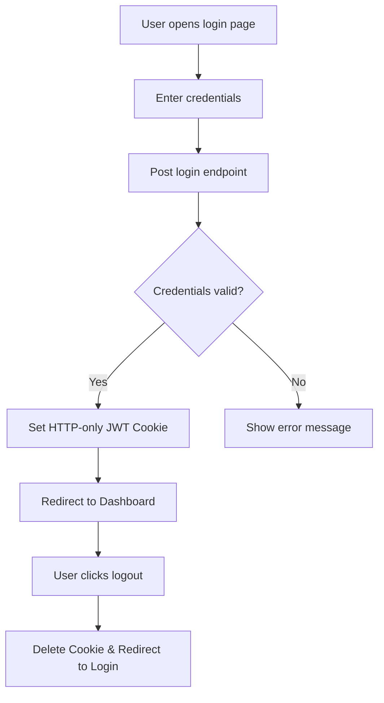

# Feature: Authentication & Session Management

## 1. Feature Overview
Fitur ini menangani registrasi user baru, login user, logout user, dan pengambilan status user yang sedang aktif (`/me`). Sesi user diamankan menggunakan JSON Web Tokens (JWT) yang disimpan di dalam cookie berjenis **HTTP-Only** untuk mencegah serangan Cross-Site Scripting (XSS).
- **Pengguna**: Seluruh pengguna (User & Admin) yang ingin mengakses dashboard ThreatLens.
- **Pentingnya Fitur**: Mencegah akses yang tidak sah ke dashboard defensive dan memastikan privasi workspace project.
- **Scope**: Global (berfungsi di seluruh aplikasi).
- **Akses**: Semua user (regular dan admin).

## 2. User Flow
1. User membuka halaman registrasi `/register` atau login `/login`.
2. Untuk registrasi, user menginput Nama, Email, dan Password. Sistem membuat akun user baru dan menyimpannya di DB SQLite.
3. Untuk login, user menginput Email dan Password.
4. Backend memverifikasi credential, membuat JWT, dan mengembalikannya ke browser sebagai HTTP-Only Cookie `threatlens_access_token`.
5. Frontend memuat data session melaui `getCurrentUser()` dan mengarahkan ke dashboard utama.
6. User dapat menekan tombol Logout pada profil untuk menghapus cookie dan kembali ke layar login.



## 3. Route and Page Structure
| Route | File Path | Purpose | Auth Required | Role |
| :--- | :--- | :--- | :--- | :--- |
| `/login` | `apps/web/app/login/page.tsx` | Halaman login user | No | All |
| `/register` | `apps/web/app/register/page.tsx` | Halaman registrasi user | No | All |
| `/dashboard` | `apps/web/app/dashboard/page.tsx` | Halaman utama setelah terautentikasi | Yes | All |

*Catatan:* Saringan otentikasi di sisi Next.js diatur oleh `apps/web/middleware.ts` yang mendeteksi keberadaan token.

## 4. Backend API Endpoints
| Method | Endpoint | Router File | Purpose | Auth Required | Role |
| :--- | :--- | :--- | :--- | :--- | :--- |
| `POST` | `/api/v1/auth/register` | `apps/api/app/routers/auth.py` | Registrasi akun baru | No | All |
| `POST` | `/api/v1/auth/login` | `apps/api/app/routers/auth.py` | Autentikasi credential user & set cookie | No | All |
| `POST` | `/api/v1/auth/logout` | `apps/api/app/routers/auth.py` | Menghapus token cookie session | No | All |
| `GET` | `/api/v1/auth/me` | `apps/api/app/routers/auth.py` | Mengambil data user yang sedang aktif | Yes | All |

## 5. Main Functions and Responsibilities

### 5.1 Frontend Functions
- **`registerUser(data)`**
  - **File**: `apps/web/lib/api.ts`
  - **Purpose**: Melakukan registrasi akun baru ke backend.
  - **Input**: `data: any` (berisi name, email, password)
  - **Output**: JSON objek user yang baru dibuat.
  - **Called by**: `apps/web/app/register/page.tsx`
  - **Calls**: `POST /api/v1/auth/register`
- **`loginUser(data)`**
  - **File**: `apps/web/lib/api.ts`
  - **Purpose**: Mengirim credential untuk mendapatkan token otentikasi.
  - **Input**: `data: any` (berisi email, password)
  - **Output**: JSON objek status login dan detail singkat user.
  - **Called by**: `apps/web/app/login/page.tsx`
  - **Calls**: `POST /api/v1/auth/login`
- **`logoutUser()`**
  - **File**: `apps/web/lib/api.ts`
  - **Purpose**: Menginstruksikan backend untuk menghapus cookie JWT.
  - **Input**: -
  - **Output**: JSON objek pesan sukses logout.
  - **Called by**: `apps/web/hooks/useAuth.ts`
  - **Calls**: `POST /api/v1/auth/logout`
- **`getCurrentUser()`**
  - **File**: `apps/web/lib/api.ts`
  - **Purpose**: Mendapatkan detail info user saat ini berdasarkan JWT cookie.
  - **Input**: -
  - **Output**: JSON objek user info.
  - **Called by**: `apps/web/hooks/useAuth.ts`
  - **Calls**: `GET /api/v1/auth/me`

### 5.2 Backend Router Functions
- **`register(user_in, db)`**
  - **File**: `apps/api/app/routers/auth.py`
  - **Endpoint**: `POST /api/v1/auth/register`
  - **Purpose**: Mengecek email duplikat, melakukan hashing password, dan menyimpan data user di DB.
  - **Input**: `user_in: UserRegister`, `db: Session`
  - **Output**: User database model.
- **`login(user_in, response, db)`**
  - **File**: `apps/api/app/routers/auth.py`
  - **Endpoint**: `POST /api/v1/auth/login`
  - **Purpose**: Memverifikasi credential user, memproduksi JWT token, dan menyimpan JWT ke cookie respon dengan opsi `httponly=True`.
- **`logout(response)`**
  - **File**: `apps/api/app/routers/auth.py`
  - **Endpoint**: `POST /api/v1/auth/logout`
  - **Purpose**: Menginstruksikan client untuk menghapus cookie `threatlens_access_token`.

### 5.3 Backend Service / Core Functions
- **`get_password_hash(password)`**
  - **File**: `apps/api/app/core/security.py`
  - **Purpose**: Melakukan hashing password menggunakan algoritma bcrypt.
- **`verify_password(plain_password, hashed_password)`**
  - **File**: `apps/api/app/core/security.py`
  - **Purpose**: Membandingkan input password mentah dengan hash di DB.
- **`create_access_token(data, expires_delta)`**
  - **File**: `apps/api/app/core/security.py`
  - **Purpose**: Membuat string JWT baru yang ditandatangani oleh SECRET_KEY dengan masa kedaluwarsa.

### 5.4 Model and Schema Functions / Classes
- **`User`**
  - **File**: `apps/api/app/models/user.py`
  - **Type**: SQLAlchemy Model
  - **Purpose**: Menyimpan record akun user. Field utama: `id`, `name`, `email`, `hashed_password`, `role`, `project_limit`, `token_limit`.
- **`UserRegister`**
  - **File**: `apps/api/app/schemas/auth.py`
  - **Type**: Pydantic Schema
  - **Purpose**: Validasi input saat registrasi (nama, email, password).

## 6. Function Connection Map
```
apps/web/app/login/page.tsx
→ loginUser(data) in apps/web/lib/api.ts
  → POST /api/v1/auth/login
    → login() in apps/api/app/routers/auth.py
      → verify_password() in apps/api/app/core/security.py
      → create_access_token() in apps/api/app/core/security.py
      → Response cookie set "threatlens_access_token"
```

## 7. Tech Stack Used in This Feature
| Tech | Used In | Purpose | Related Code |
| :--- | :--- | :--- | :--- |
| Next.js Middleware | Frontend Auth Gateway | Memblokir rute halaman tanpa token | `apps/web/middleware.ts` |
| PyJWT | JWT Sign/Decode | Membuat token terenkripsi | `apps/api/app/core/security.py` |
| Passlib (bcrypt) | Hashing password | Mengamankan penyimpanan sandi | `apps/api/app/core/security.py` |
| HTTP-Only Cookie | Transport Session | Mencegah pembacaan token via browser JS | `apps/api/app/routers/auth.py` |

## 8. Code Reference
Code: **login() router endpoint**
File: `apps/api/app/routers/auth.py`
```python
    response.set_cookie(
        key="threatlens_access_token",
        value=access_token,
        httponly=True,
        max_age=settings.ACCESS_TOKEN_EXPIRE_MINUTES * 60,
        expires=settings.ACCESS_TOKEN_EXPIRE_MINUTES * 60,
        samesite="lax",
        secure=settings.COOKIE_SECURE,
        path="/"
    )
```
Snippet di atas menyetel cookie JWT ke client dengan flag `httponly=True` yang mencegah script JavaScript jahat mengakses token (mitigasi XSS).

## 9. Security and Safety Notes
- Token diproteksi di cookie server-side, tidak pernah disimpan di `localStorage` frontend.
- Flag `samesite="lax"` digunakan untuk menyeimbangkan kegunaan navigasi dan pertahanan CSRF.
- Dependensi `get_current_admin_user` bertindak sebagai checkpoint otentikasi ketat untuk operasi-operasi admin-only seperti modifikasi rule global.

## 10. Error Handling and Empty State
- Validasi email duplikat di backend mengembalikan error status `400 Bad Request`.
- Upaya akses halaman berproteksi tanpa cookie memicu redirect ke `/login` oleh `middleware.ts`.
- Login yang salah memicu respons `401 Unauthorized` dengan pesan "Incorrect email or password".

## 11. Current Limitations
- **Local SQLite**: Database lokal SQLite untuk penyimpanan data otentikasi belum dienkripsi secara fisik.
- **OAuth / SSO**: Belum ada dukungan SSO (Single Sign-On) seperti OAuth Google atau GitHub untuk MVP ini.

## 12. Future Improvements
- Tambahkan integrasi OAuth2 untuk login dengan satu klik menggunakan Google/GitHub.
- Implementasikan sistem Refresh Token untuk sesi jangka panjang yang aman.

## 13. Related Files
- **Frontend**:
  - `apps/web/app/login/page.tsx`
  - `apps/web/app/register/page.tsx`
  - `apps/web/middleware.ts`
  - `apps/web/hooks/useAuth.ts`
  - `apps/web/components/UserMenu.tsx`
- **Backend**:
  - `apps/api/app/routers/auth.py`
  - `apps/api/app/core/security.py`
  - `apps/api/app/dependencies/auth.py`
  - `apps/api/app/models/user.py`
