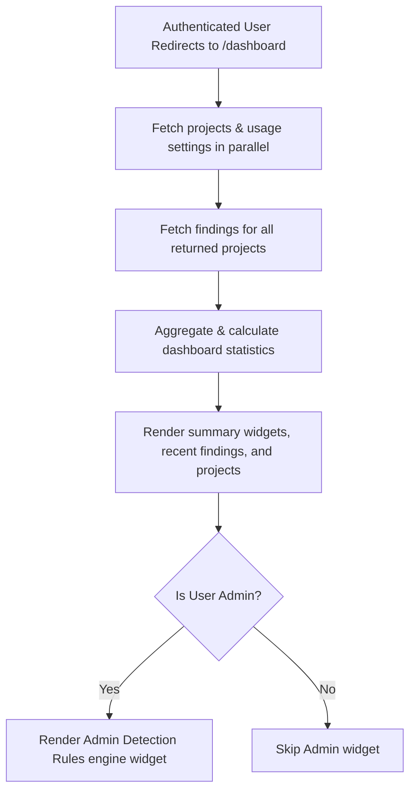

# Feature: Dashboard Overview

## 1. Feature Overview
Dashboard adalah pusat informasi utama (landing page setelah login) yang merangkum status keamanan seluruh project secara terpusat. Dashboard menyediakan statistik penting seperti jumlah project, total pemakaian token AI investigator, jumlah total temuan aktif (Open Findings), dan daftar temuan dengan tingkat keparahan tinggi. Bagi pengguna dengan peran admin, dashboard juga memuat widget kontrol ringkas mesin aturan deteksi (detection rules engine).
- **Pengguna**: Seluruh pengguna terdaftar (Regular & Admin).
- **Pentingnya Fitur**: Memberikan gambaran kilat (*security posture snapshot*) terhadap seluruh infrastruktur dan temuan berisiko tinggi tanpa harus membuka satu per satu workspace project.
- **Scope**: Global (lintas semua project yang dimiliki user).
- **Akses**: Semua user (regular dan admin). Tampilan admin memiliki tambahan informasi manajemen aturan.

## 2. User Flow
1. User masuk ke aplikasi dan berhasil diautentikasi.
2. Halaman root `/` mengarahkan user ke `/dashboard`.
3. Dashboard memuat data project dan pemakaian token secara paralel.
4. Sistem mengambil data temuan (*findings*) untuk setiap project milik user.
5. User melihat widget ringkasan:
   - Jumlah Project
   - Akumulasi Token AI yang digunakan
   - Total Findings dengan status 'open'
   - Temuan berisiko tinggi (High/Critical)
6. User dapat melihat daftar 5 temuan berisiko tinggi terbaru (*Recent High Risk Findings*) dan mengkliknya untuk navigasi cepat ke detail temuan.
7. User melihat daftar 3 project teranyar (*Recent Projects*) untuk masuk kembali ke workspace terkait.



## 3. Route and Page Structure
| Route | File Path | Purpose | Auth Required | Role |
| :--- | :--- | :--- | :--- | :--- |
| `/dashboard` | `apps/web/app/dashboard/page.tsx` | Dashboard utama | Yes | All |

## 4. Backend API Endpoints
| Method | Endpoint | Router File | Purpose | Auth Required | Role |
| :--- | :--- | :--- | :--- | :--- | :--- |
| `GET` | `/api/v1/projects/` | `apps/api/app/routers/projects.py` | Mendapatkan daftar project milik user | Yes | User/Admin |
| `GET` | `/api/v1/settings/usage` | `apps/api/app/routers/settings.py` | Mengambil data kuota project dan token user | Yes | User/Admin |
| `GET` | `/api/v1/projects/{project_id}/findings` | `apps/api/app/routers/findings.py` | Mengambil data temuan untuk project tertentu | Yes | User/Admin |
| `GET` | `/api/v1/settings/detection-rules` | `apps/api/app/routers/settings.py` | Mengambil semua aturan deteksi sistem | Yes | Admin Only |

## 5. Main Functions and Responsibilities

### 5.1 Frontend Functions
- **`getProjects()`**
  - **File**: `apps/web/lib/api.ts`
  - **Purpose**: Mengambil list project yang dapat diakses oleh user.
  - **Input**: -
  - **Output**: `Project[]`
  - **Called by**: `apps/web/app/dashboard/page.tsx`
  - **Calls**: `GET /api/v1/projects/`
- **`getUsageSettings()`**
  - **File**: `apps/web/lib/api.ts`
  - **Purpose**: Mengambil data batas kuota limit token dan project untuk user aktif.
  - **Input**: -
  - **Output**: `{ project_limit: int, token_limit: int }`
  - **Called by**: `apps/web/app/dashboard/page.tsx`
  - **Calls**: `GET /api/v1/settings/usage`
- **`getProjectFindings(projectId)`**
  - **File**: `apps/web/lib/api.ts`
  - **Purpose**: Mengambil temuan di dalam project tertentu.
  - **Input**: `projectId: string`
  - **Output**: `Finding[]`
  - **Called by**: `apps/web/app/dashboard/page.tsx`
  - **Calls**: `GET /api/v1/projects/{project_id}/findings`
- **`getDetectionRules()`** (Dynamic Import)
  - **File**: `apps/web/lib/api.ts`
  - **Purpose**: Mengambil aturan deteksi global untuk widget dashboard admin.
  - **Input**: -
  - **Output**: `DetectionRule[]`
  - **Called by**: `apps/web/app/dashboard/page.tsx` (diakses di dalam blok try-catch admin)
  - **Calls**: `GET /api/v1/settings/detection-rules`

### 5.2 Backend Router Functions
- **`get_projects(db, current_user)`**
  - **File**: `apps/api/app/routers/projects.py`
  - **Endpoint**: `GET /api/v1/projects/`
  - **Purpose**: Mengembalikan seluruh project dari database jika role user adalah admin, atau hanya mengembalikan project milik user jika role regular user.
- **`get_usage(db, current_user)`**
  - **File**: `apps/api/app/routers/settings.py`
  - **Endpoint**: `GET /api/v1/settings/usage`
  - **Purpose**: Mengembalikan kuota limit token dan project yang terikat ke profile user.
- **`get_detection_rules(db, current_user)`**
  - **File**: `apps/api/app/routers/settings.py`
  - **Endpoint**: `GET /api/v1/settings/detection-rules`
  - **Purpose**: Membaca semua baris konfigurasi deteksi sistem global. Hanya dapat diakses oleh user dengan role `admin` atau `system_admin`.

### 5.3 Backend Service Functions
*Status: Not found in current codebase.* Data dikomparasi dan diagregasi langsung di tingkat router API dan kode server frontend.

### 5.4 Model and Schema Classes
- **`Project`**
  - **File**: `apps/api/app/models/project.py`
  - **Type**: SQLAlchemy Model
  - **Purpose**: Menyimpan data project. Field penentu dashboard: `posture_score`, `token_used`, `risk_level`.

## 6. Function Connection Map
```
apps/web/app/dashboard/page.tsx
→ getProjects() & getUsageSettings() in apps/web/lib/api.ts
  → GET /api/v1/projects/ & GET /api/v1/settings/usage
    → get_projects() & get_usage() in backend
```

## 7. Tech Stack Used in This Feature
| Tech | Used In | Purpose | Related Code |
| :--- | :--- | :--- | :--- |
| Next.js App Router | Frontend routing | Server Component rendering | `apps/web/app/dashboard/page.tsx` |
| Parallel Promises (`Promise.all`) | Frontend fetching | Mempercepat loading dashboard | `apps/web/app/dashboard/page.tsx` |

## 8. Code Reference
Code: **Dashboard Aggregation and Render**
File: `apps/web/app/dashboard/page.tsx`
```typescript
    // Fetch findings for all projects to aggregate
    const findingsPromises = projects.map(p => getProjectFindings(p.id));
    const findingsResults = await Promise.all(findingsPromises);

    // Attach project info to findings for global display
    findingsResults.forEach((projectFindings: any[], idx) => {
      const projectName = projects[idx].name;
      const enriched = projectFindings.map(f => ({ ...f, projectName }));
      allFindings = [...allFindings, ...enriched];
    });
```
Snippet ini memperlihatkan pemuatan paralel temuan dari seluruh project milik pengguna saat ini secara paralel, meningkatkan efisiensi load data dashboard di tingkat Server Component.

## 9. Security and Safety Notes
- Pengaksesan dashboard disaring secara ketat berdasarkan token otentikasi.
- Jika pengguna non-admin mencoba memuat dashboard, sistem secara otomatis menangani error ketika API `/settings/detection-rules` menolak akses (status 403) dengan melempar exception di blok try-catch khusus sehingga halaman tetap dapat dibuka dengan menyembunyikan widget admin.

## 10. Error Handling and Empty State
- Halaman dibungkus dengan komponen `ErrorState` jika pengambilan data project utama gagal.
- Halaman dashboard memiliki pesan penanganan tersendiri jika recent findings kosong: "No high risk findings detected."
- Halaman dashboard memiliki pesan penanganan jika project list kosong: "No projects available."

## 11. Current Limitations
- Dashboard belum mendukung visualisasi chart dinamis untuk total statistik tren (hanya tulisan teks statis).
- Data agregasi ditarik per project, yang dapat menurunkan kinerja jika pengguna memiliki puluhan project (membutuhkan optimasi query agregat di backend untuk rilis produksi).

## 12. Future Improvements
- Implementasikan endpoint tunggal untuk memuat data agregat dashboard `/api/v1/dashboard/summary` dari sisi backend.
- Tambahkan grafik trend (line chart) untuk posture score dan total findings per bulan.

## 13. Related Files
- **Frontend**:
  - `apps/web/app/dashboard/page.tsx`
  - `apps/web/lib/api.ts`
- **Backend**:
  - `apps/api/app/routers/projects.py`
  - `apps/api/app/routers/settings.py`
  - `apps/api/app/routers/findings.py`
