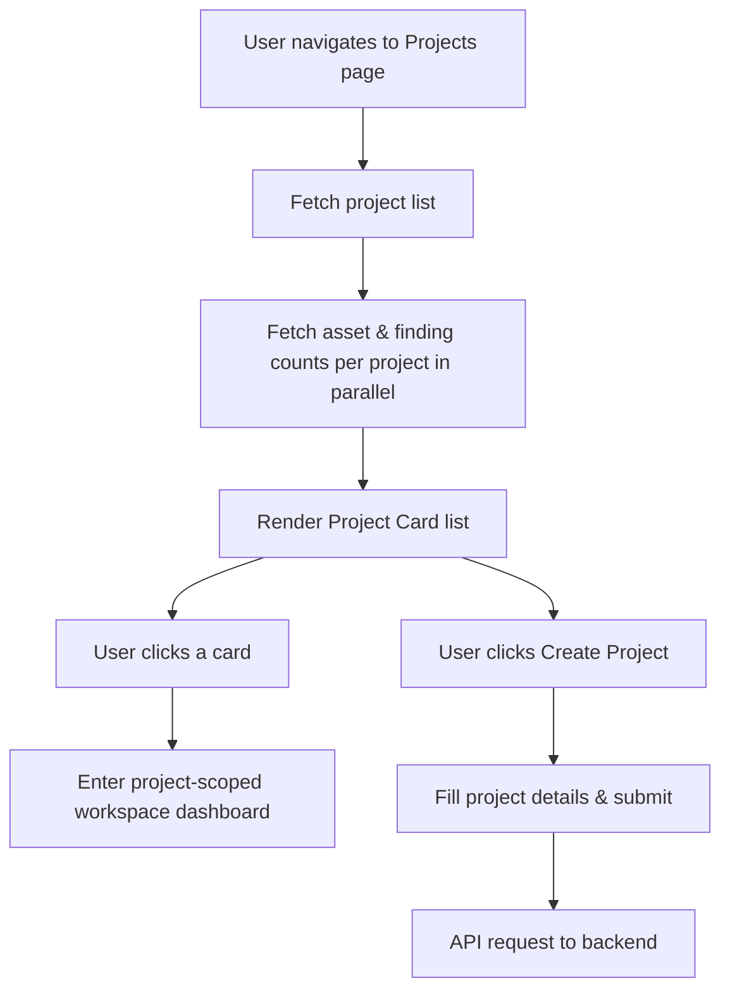

# Feature: Project Workspaces & Management

## 1. Feature Overview
Project-Scoped Workspace adalah fondasi isolasi data di ThreatLens. Setiap aset, scanning, finding, log kejadian, attack graph, dan laporan dibatasi secara ketat dalam lingkup Project tertentu. Pengguna dapat mengelompokkan analisis berdasarkan tipe lingkungan kerja (Staging, Demo, Lab, Development, Production) dan melihat ringkasan status keamanan masing-masing workspace melalui metrik skor kepatuhan (*posture score*) dan tingkat risiko (*risk level*).
- **Pengguna**: Seluruh pengguna terdaftar (Regular & Admin).
- **Pentingnya Fitur**: Menjamin isolasi data dan menyajikan analisis keamanan yang terorganisir per aplikasi/lingkungan.
- **Scope**: Project-scoped (seluruh data findings, assets, scans dll. diisolasi per project).
- **Akses**: Regular user hanya dapat melihat/mengakses project miliknya. Administrator dapat melihat semua project secara global.

## 2. User Flow
1. User masuk ke menu **Projects** dari sidebar.
2. Sistem memuat daftar project beserta akumulasi aset dan temuan keamanan yang terikat di dalamnya.
3. User mengklik salah satu card project untuk masuk ke detail workspace.
4. User dapat melihat ringkasan keamanan project, termasuk tingkat risiko (High, Medium, Low) dan skor keamanan (*posture score*).
5. User dapat mengeklik tombol **Create Project** untuk menambahkan workspace baru, mengisi nama, deskripsi, dan lingkungan target.
6. Halaman form mengirimkan input ke backend. *(Catatan: Proses penyimpanan creation saat ini berstatus mock-up)*.



## 3. Route and Page Structure
| Route | File Path | Purpose | Auth Required | Role |
| :--- | :--- | :--- | :--- | :--- |
| `/projects` | `apps/web/app/projects/page.tsx` | Menampilkan seluruh project | Yes | All |
| `/projects/new` | `apps/web/app/projects/new/page.tsx` | Formulir pembuatan project baru | Yes | All |
| `/projects/[id]` | `apps/web/app/projects/[id]/page.tsx` | Halaman beranda spesifik project | Yes | All |

## 4. Backend API Endpoints
| Method | Endpoint | Router File | Purpose | Auth Required | Role |
| :--- | :--- | :--- | :--- | :--- | :--- |
| `GET` | `/api/v1/projects/` | `apps/api/app/routers/projects.py` | Mengambil list project terotorisasi | Yes | All |
| `POST` | `/api/v1/projects/` | `apps/api/app/routers/projects.py` | Registrasi project baru (Status: Partial Mock) | Yes | All |
| `GET` | `/api/v1/projects/{project_id}` | `apps/api/app/routers/projects.py` | Membaca detail metadata project | Yes | All |
| `PUT` | `/api/v1/projects/{project_id}` | `apps/api/app/routers/projects.py` | Modifikasi metadata project (Status: Partial Mock) | Yes | All |
| `DELETE` | `/api/v1/projects/{project_id}` | `apps/api/app/routers/projects.py` | Menghapus workspace project (Status: Partial Mock) | Yes | All |

## 5. Main Functions and Responsibilities

### 5.1 Frontend Functions
- **`getProjects()`**
  - **File**: `apps/web/lib/api.ts`
  - **Purpose**: Mengambil list project terotorisasi.
  - **Input**: -
  - **Output**: `Project[]`
  - **Called by**: `apps/web/app/projects/page.tsx`
  - **Calls**: `GET /api/v1/projects/`
- **`createProject(data)`**
  - **File**: `apps/web/lib/api.ts`
  - **Purpose**: Mengirim data project baru ke API.
  - **Input**: `data: { name: string, description: string, environment: string }`
  - **Output**: `{ msg: "Project created" }` (Mock payload)
  - **Called by**: `apps/web/app/projects/new/page.tsx`
  - **Calls**: `POST /api/v1/projects/`

### 5.2 Backend Router Functions
- **`get_projects(db, current_user)`**
  - **File**: `apps/api/app/routers/projects.py`
  - **Purpose**: Mengambil record project dari basis data. Admin mendapatkan seluruh baris DB, sedangkan regular user hanya mendapatkan project yang memiliki field `user_id == current_user.id`.
- **`create_project(current_user)`**
  - **File**: `apps/api/app/routers/projects.py`
  - **Status**: **Partially implemented (Mock)**
  - **Purpose**: Saat ini hanya mengembalikan string JSON sukses `{"msg": "Project created"}` tanpa menulis record baru ke database.

### 5.3 Backend Service Functions
*Status: Not found in current codebase.* Logika queries dijalankan langsung pada router SQLAlchemy.

### 5.4 Model and Schema Classes
- **`Project`**
  - **File**: `apps/api/app/models/project.py`
  - **Type**: SQLAlchemy Model
  - **Purpose**: Menyimpan metadata workspace. Field utama: `id`, `user_id`, `name`, `environment`, `risk_level`, `posture_score`, `token_used`.

## 6. Function Connection Map
```
apps/web/app/projects/page.tsx
→ getProjects() in apps/web/lib/api.ts
  → GET /api/v1/projects/
    → get_projects() in apps/api/app/routers/projects.py
      → Query database Project model
      → returns Project[] to frontend
```

## 7. Tech Stack Used in This Feature
| Tech | Used In | Purpose | Related Code |
| :--- | :--- | :--- | :--- |
| Next.js App Router | Routing & Layouts | Pemisahan sub-halaman project | `apps/web/app/projects/[id]/` |
| SQLAlchemy ORM | DB Query | Filter kepemilikan project | `apps/api/app/routers/projects.py` |

## 8. Code Reference
Code: **get_projects() ownership filter**
File: `apps/api/app/routers/projects.py`
```python
@router.get("/")
def get_projects(db: Session = Depends(get_db), current_user: User = Depends(get_current_user)):
    if current_user.role in ["admin", "system_admin"]:
        return db.query(Project).all()
    return db.query(Project).filter(Project.user_id == current_user.id).all()
```
Snippet ini mengimplementasikan batasan keamanan kepemilikan data di mana non-admin hanya dapat melihat project buatan mereka sendiri.

## 9. Security and Safety Notes
- Pengaksesan didasari pengecekan `get_owned_project_or_404(db, project_id, current_user)` untuk setiap project-scoped endpoint. Jika user mencoba menebak ID project orang lain, endpoint akan mengembalikan HTTP 404.
- Administrator dikecualikan dari pengecekan kepemilikan agar dapat memonitor kepatuhan secara holistik.

## 10. Error Handling and Empty State
- Jika request API gagal tersambung, frontend merender komponen `ErrorState` dengan pesan: "Failed to connect to backend API to load projects."
- Jika jumlah project adalah nol, frontend menggunakan komponen `EmptyState` untuk memandu user: "No projects found. Create your first project to start investigating."

## 11. Current Limitations
- **Mock Write Ops**: Endpoint untuk membuat (`POST`), memperbarui (`PUT`), dan menghapus (`DELETE`) project pada backend saat ini masih berstatus mockup (`{"msg": "Project created"}` dll.) dan tidak menyimpan perubahan baru di database SQLite.
- **Project Limits Enforcement**: Logika penolakan pembuatan project baru jika user melebihi limit `project_limit` belum aktif pada backend.

## 12. Future Improvements
- Implemetasikan penulisan database nyata untuk penambahan, pengeditan, dan penghapusan project.
- Aktifkan validasi batas limit pembuatan project (`project_limit`) sesuai paket user saat pendaftaran.

## 13. Related Files
- **Frontend**:
  - `apps/web/app/projects/page.tsx`
  - `apps/web/app/projects/new/page.tsx`
  - `apps/web/app/projects/[id]/page.tsx`
- **Backend**:
  - `apps/api/app/routers/projects.py`
  - `apps/api/app/models/project.py`
  - `apps/api/app/dependencies/ownership.py`
