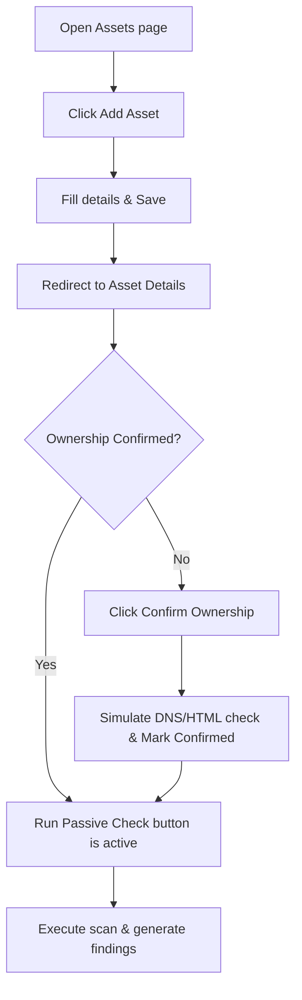

# Feature: Asset Inventory & Verification

## 1. Feature Overview
Asset Inventory & Verification memungkinkan user untuk mendaftarkan target/aset digital (seperti URL situs web, API endpoint, repositori kode, dll.) ke dalam project workspace untuk diawasi kesehatannya. Sebelum pemindaian keamanan dapat dijalankan, pengguna **wajib mengonfirmasi kepemilikan aset** tersebut. Mekanisme ini menyimulasikan proses verifikasi kepemilikan defensif (seperti penambahan DNS TXT record atau meta tag html).
- **Pengguna**: Seluruh pengguna terdaftar (Regular & Admin).
- **Pentingnya Fitur**: Menegakkan batasan etis (*defensive boundaries*) agar pengguna tidak menjalankan analisis keamanan pada target di luar kendali atau otorisasi mereka.
- **Scope**: Project-scoped (Aset terisolasi di dalam workspace project).
- **Akses**: Semua user (regular dan admin).

## 2. User Flow
1. User membuka halaman Assets pada project tertentu (`/projects/[id]/assets`).
2. User mengklik **Add Asset**.
3. User mengisi detail target: Nama Aset, Tipe (Website URL, API Endpoint, dll.), Nilai/Target (misalnya `api.example.com`), Lingkungan, Deskripsi, dan menyetujui pernyataan etis penggunaan alat.
4. User menyimpan formulir. Aset berhasil terdaftar dengan status kepemilikan **Unconfirmed**.
5. User diarahkan ke halaman detail aset (`/projects/[id]/assets/[assetId]`).
6. Di halaman detail, user melihat status kepemilikan belum terverifikasi dan mengeklik **Confirm Ownership**.
7. Sistem menyimulasikan verifikasi DNS/HTML dan mengubah status aset menjadi **Confirmed**.
8. Setelah terkonfirmasi, tombol **Run Passive Check** menjadi aktif, dan user dapat mengkliknya untuk memulai passive scan.



## 3. Route and Page Structure
| Route | File Path | Purpose | Auth Required | Role |
| :--- | :--- | :--- | :--- | :--- |
| `/projects/[id]/assets` | `apps/web/app/projects/[id]/assets/page.tsx` | Menampilkan seluruh aset di project | Yes | All |
| `/projects/[id]/assets/new` | `apps/web/app/projects/[id]/assets/new/page.tsx` | Form penambahan aset baru | Yes | All |
| `/projects/[id]/assets/[assetId]` | `apps/web/app/projects/[id]/assets/[assetId]/page.tsx` | Detail aset, konfirmasi, & jalankan scan | Yes | All |
| `/projects/[id]/assets/[assetId]/edit` | `apps/web/app/projects/[id]/assets/[assetId]/edit/page.tsx` | Form pengeditan metadata aset | Yes | All |

## 4. Backend API Endpoints
| Method | Endpoint | Router File | Purpose | Auth Required | Role |
| :--- | :--- | :--- | :--- | :--- | :--- |
| `GET` | `/api/v1/projects/{project_id}/assets` | `apps/api/app/routers/assets.py` | Ambil semua aset di project | Yes | User/Admin |
| `POST` | `/api/v1/projects/{project_id}/assets` | `apps/api/app/routers/assets.py` | Registrasi aset baru | Yes | User/Admin |
| `GET` | `/api/v1/projects/{project_id}/assets/{asset_id}` | `apps/api/app/routers/assets.py` | Ambil detail spesifik aset | Yes | User/Admin |
| `PUT` | `/api/v1/projects/{project_id}/assets/{asset_id}` | `apps/api/app/routers/assets.py` | Perbarui metadata aset | Yes | User/Admin |
| `DELETE` | `/api/v1/projects/{project_id}/assets/{asset_id}` | `apps/api/app/routers/assets.py` | Hapus aset dari project | Yes | User/Admin |
| `POST` | `/api/v1/projects/{project_id}/assets/{asset_id}/confirm-ownership` | `apps/api/app/routers/assets.py` | Konfirmasi kepemilikan aset (DNS/TXT/Meta tag) | Yes | User/Admin |
| `POST` | `/api/v1/projects/{project_id}/assets/{asset_id}/passive-check` | `apps/api/app/routers/assets.py` | Jalankan pemindaian defensif pasif | Yes | User/Admin |

## 5. Main Functions and Responsibilities

### 5.1 Frontend Functions (di `apps/web/lib/api.ts`)
- **`getProjectAssets(projectId)`**
  - **Purpose**: Mengambil koleksi aset yang berada dalam project.
  - **Called by**: `apps/web/app/projects/[id]/assets/page.tsx`
- **`createProjectAsset(projectId, data)`**
  - **Purpose**: Mendaftarkan aset baru.
  - **Called by**: `apps/web/app/projects/[id]/assets/new/page.tsx`
- **`confirmProjectAssetOwnership(projectId, assetId)`**
  - **Purpose**: Mengirim perintah verifikasi kepemilikan target.
  - **Called by**: `apps/web/app/projects/[id]/assets/[assetId]/page.tsx`
- **`runPassiveCheck(projectId, assetId)`**
  - **Purpose**: Menginstruksikan backend untuk mengaktifkan passive scanner.
  - **Called by**: `apps/web/app/projects/[id]/assets/[assetId]/page.tsx`

### 5.2 Backend Router Functions (`apps/api/app/routers/assets.py`)
- **`create_asset(project_id, asset, db, current_user)`**
  - **Purpose**: Menambahkan instansi `Asset` baru ke dalam database terkait ID project.
- **`confirm_ownership(project_id, asset_id, db, current_user)`**
  - **Purpose**: Memverifikasi otoritas kepemilikan target dan mengubah properti `ownership_confirmed = True`.
- **`passive_check(project_id, asset_id, db, current_user)`**
  - **Purpose**: Melakukan check apakah kepemilikan telah diverifikasi, lalu meneruskan parameter ke `PassiveChecker.run_check()`.

### 5.3 Backend Service Functions
- **`PassiveChecker.run_check(db, project_id, asset_id, asset_type)`**
  - **File**: `apps/api/app/services/passive_checker.py`
  - **Purpose**: Memproses simulasi pemindaian defensif non-intrusif pada aset yang dipilih (lihat dokumentasi modul Passive Platform Checker).

### 5.4 Model and Schema Classes
- **`Asset`**
  - **File**: `apps/api/app/models/asset.py`
  - **Type**: SQLAlchemy Model
  - **Field penting**: `id`, `project_id`, `name`, `type`, `value`, `environment`, `description`, `ownership_confirmed` (Boolean), `last_checked_at`.
- **`AssetCreate`**
  - **File**: `apps/api/app/schemas/asset.py`
  - **Type**: Pydantic Schema
  - **Validator**: Mengatur agar input `value` berupa format domain/IP atau URL HTTP/HTTPS menggunakan Regex `validate_value`.

## 6. Function Connection Map
```
apps/web/app/projects/[id]/assets/[assetId]/page.tsx
→ confirmProjectAssetOwnership(projectId, assetId)
  → POST /api/v1/projects/{project_id}/assets/{asset_id}/confirm-ownership
    → confirm_ownership() in apps/api/app/routers/assets.py
      → Set asset.ownership_confirmed = True
      → Save to Database & return updated Asset object
```

## 7. Tech Stack Used in This Feature
| Tech | Used In | Purpose | Related Code |
| :--- | :--- | :--- | :--- |
| Next.js App Router | Dynamic Routing | Membuka halaman detail dinamis | `apps/web/app/projects/[id]/assets/[assetId]/page.tsx` |
| Pydantic Custom Validator | API Validation | Validasi host/URL secara ketat di backend | `apps/api/app/schemas/asset.py` |

## 8. Code Reference
Code: **validate_value validator**
File: `apps/api/app/schemas/asset.py`
```python
    @validator('value')
    def validate_value(cls, v, values):
        if 'type' in values:
            if values['type'] in ['website_url', 'api_endpoint']:
                # Support: http://..., https://..., or domain/IP/host (e.g. api.example.com, localhost:3000)
                if not re.match(r'^(https?://)?([a-zA-Z0-9.-]+)(:\d+)?(/.*)?$', v):
                    raise ValueError('Must be a valid URL or domain name')
            if not v or v.strip() == "":
                raise ValueError("Value cannot be empty")
        return v
```
Snippet ini memverifikasi bahwa target masukan bertipe web URL atau API endpoint ditulis dengan format URL atau nama domain (hostname) yang valid.

## 9. Security and Safety Notes
- Logika scan defensif pasif (`/passive-check`) dijaga dengan pengondisian tegas:
  ```python
  if not asset.ownership_confirmed:
      raise HTTPException(status_code=400, detail="Asset ownership must be confirmed before running passive checks.")
  ```
  Hal ini mencegah pemanggilan eksekusi scan secara langsung tanpa konfirmasi kepemilikan aset terlebih dahulu.

## 10. Error Handling and Empty State
- Apabila user memasukkan alamat domain target tanpa format yang valid, backend mengembalikan status error 422 (Pydantic validation error) yang ditangkap oleh frontend untuk menampilkan pesan kesalahan masukan.
- Bila data aset kosong, `assets/page.tsx` merender pesan: "No assets yet. Add a website, API endpoint, repository, or demo target to start defensive analysis."

## 11. Current Limitations
- Konfirmasi kepemilikan masih berupa **proses simulasi (mockup)**. Sistem tidak benar-benar mengecek DNS TXT record riil pada internet publik, melainkan langsung menyetujui (`ownership_confirmed = True`) ketika tombol ditekan.

## 12. Future Improvements
- Implemetasikan pengecekan DNS TXT record eksternal secara riil menggunakan librari `dnspython`.
- Implemetasikan pengecekan meta tag HTML pada root URL untuk alternatif verifikasi.

## 13. Related Files
- **Frontend**:
  - `apps/web/app/projects/[id]/assets/page.tsx`
  - `apps/web/app/projects/[id]/assets/new/page.tsx`
  - `apps/web/app/projects/[id]/assets/[assetId]/page.tsx`
- **Backend**:
  - `apps/api/app/routers/assets.py`
  - `apps/api/app/schemas/asset.py`
  - `apps/api/app/models/asset.py`
  - `apps/api/app/services/passive_checker.py`
