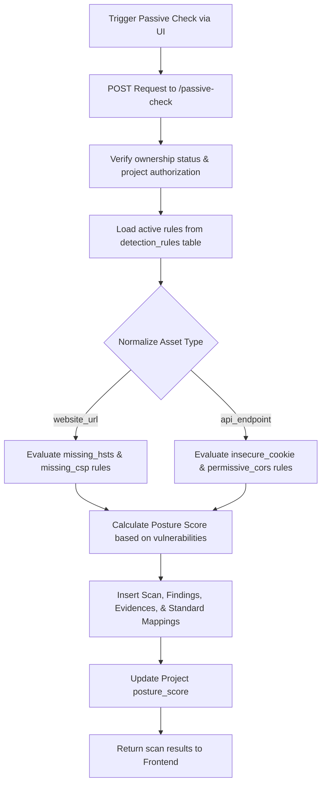

# Feature: Passive Platform Checker

## 1. Feature Overview
Passive Platform Checker adalah mesin pemindaian defensif inti dalam ThreatLens. Berbeda dari scanner penetrasi ofensif, modul ini **hanya menyimulasikan pengumpulan metadata non-intrusif** (seperti pengecekan header keamanan HTTP, flag cookie, SSL, dan info publik lainnya) tanpa mengirim exploit payload, melakukan brute force, atau membobol autentikasi. Pemindaian hanya memicu temuan (*findings*) jika aturan deteksi terkait berstatus aktif (*enabled*) pada panel konfigurasi administrator.
- **Pengguna**: Seluruh pengguna terdaftar (Regular & Admin).
- **Pentingnya Fitur**: Menyediakan analisis kerentanan instan yang aman bagi sistem produksi, lab, atau edukasi.
- **Scope**: Project-scoped (membuat instansi scan dan findings di dalam project terkait).
- **Akses**: Semua user (regular dan admin).

## 2. User Flow
1. User masuk ke halaman detail aset yang sudah terkonfirmasi kepemilikannya.
2. User mengklik **Run Passive Check**.
3. Frontend mengirim request POST ke endpoint `/passive-check`.
4. Backend memverifikasi otorisasi kepemilikan aset.
5. Mesin `PassiveChecker` memeriksa tipe aset (`website_url` atau `api_endpoint`).
6. Mesin mencocokkan konfigurasi aktif dari tabel `detection_rules`.
7. Jika aturan HSTS, CSP, Cookie, atau CORS aktif, sistem akan:
   - Membuat record `Scan` baru berkategori "Passive" dan berstatus "completed".
   - Membuat record `Finding` baru untuk masing-masing kerentanan yang terdeteksi.
   - Membuat record `Evidence` berupa salinan data/raw log simulasi penyebab kerentanan.
   - Membuat `StandardMapping` untuk memetakan temuan ke kontrol regulasi (seperti OWASP/CWE).
   - Menghitung ulang dan memperbarui skor kepatuhan (*posture score*) project.
8. Frontend memuat ulang detail aset dan menampilkan notifikasi sukses.



## 3. Route and Page Structure
*Fitur ini tidak memiliki halaman frontend khusus. Eksekusi scan diinisiasi dari halaman detail aset:*
| Route | File Path | Purpose | Auth Required | Role |
| :--- | :--- | :--- | :--- | :--- |
| `/projects/[id]/assets/[assetId]` | `apps/web/app/projects/[id]/assets/[assetId]/page.tsx` | Tempat inisiasi pemindaian pasif | Yes | All |

## 4. Backend API Endpoints
| Method | Endpoint | Router File | Purpose | Auth Required | Role |
| :--- | :--- | :--- | :--- | :--- | :--- |
| `POST` | `/api/v1/projects/{project_id}/assets/{asset_id}/passive-check` | `apps/api/app/routers/assets.py` | Menjalankan analisis pasif pada aset | Yes | User/Admin |

## 5. Main Functions and Responsibilities

### 5.1 Frontend Functions
- **`runPassiveCheck(projectId, assetId)`**
  - **File**: `apps/web/lib/api.ts`
  - **Purpose**: Meminta backend mengeksekusi scanning.
  - **Input**: `projectId: string`, `assetId: string`
  - **Output**: JSON objek status pemindaian.

### 5.2 Backend Router Functions
- **`passive_check(project_id, asset_id, db, current_user)`**
  - **File**: `apps/api/app/routers/assets.py`
  - **Purpose**: Pintu masuk API. Memvalidasi kepemilikan aset dan memicu `PassiveChecker.run_check()`.

### 5.3 Backend Service Functions
- **`PassiveChecker.run_check(db, project_id, asset_id, asset_type)`**
  - **File**: `apps/api/app/services/passive_checker.py`
  - **Purpose**: Logika pemrosesan scan. Menampung definisi data temuan, memproses aturan aktif, menghitung posture score, membuat record `Scan`, `Finding`, `Evidence`, dan `StandardMapping` di DB.

### 5.4 Model and Schema Classes
- **`Scan`**
  - **File**: `apps/api/app/models/scan.py`
  - **Type**: SQLAlchemy Model
  - **Purpose**: Pencatatan riwayat scan. Menyimpan detail status scan, jumlah temuan berdasarkan severitas, dan skor posture yang dihasilkan scan tersebut.
- **`DetectionRule`**
  - **File**: `apps/api/app/models/detection_rule.py`
  - **Type**: SQLAlchemy Model
  - **Purpose**: Menyimpan status aturan deteksi sistem global. Menentukan apakah aturan scan (seperti `missing_hsts_header`) sedang aktif atau nonaktif.

## 6. Function Connection Map
```
apps/web/app/projects/[id]/assets/[assetId]/page.tsx
→ runPassiveCheck(projectId, assetId)
  → POST /api/v1/projects/{project_id}/assets/{asset_id}/passive-check
    → passive_check() in apps/api/app/routers/assets.py
      → PassiveChecker.run_check() in apps/api/app/services/passive_checker.py
        → Inserts Scan, Finding, Evidence, StandardMapping to SQLite
```

## 7. Tech Stack Used in This Feature
| Tech | Used In | Purpose | Related Code |
| :--- | :--- | :--- | :--- |
| FastAPI Router | Backend API | Endpoint trigger scanning | `apps/api/app/routers/assets.py` |
| SQLAlchemy ORM | Database write | Penyimpanan relasional scan dan temuan | `apps/api/app/services/passive_checker.py` |

## 8. Code Reference
Code: **PassiveChecker type normalization and check**
File: `apps/api/app/services/passive_checker.py`
```python
        asset_type_clean = asset_type.lower().replace(" ", "_")
        if asset_type_clean in ["website_url", "website"]:
            rule = rules.get("missing_hsts_header")
            if rule and rule.enabled:
                findings_data.append({
                    "title": rule.name,
                    "category": rule.category,
                    "severity": rule.severity,
                    "confidence": rule.confidence_base,
                    "blast_radius": "Low",
                    "description": "The HTTP Strict-Transport-Security response header is missing, leaving the asset vulnerable to downgrade attacks.",
                    "rule_id": rule.id,
                    "rule_key": rule.key
                })
```
Snippet di atas mencontohkan proses pemetaan tipe aset yang dinormalisasi ke format lowercase/snake-case guna mencocokkan jenis aturan deteksi yang aktif secara aman.

## 9. Security and Safety Notes
- Pengecekan status kepemilikan aset dilakukan secara tegas (`asset.ownership_confirmed`) sebelum scan dapat berjalan.
- **Defensive Boundary**: Kode ini sama sekali tidak memanggil library network eksternal (seperti `requests` atau `urllib`) untuk memindai target nyata. Pemindaian bersifat **simulasi internal** untuk meminimalisasi risiko keamanan bagi mahasiswa atau developer yang menggunakan dashboard.

## 10. Error Handling and Empty State
- Jika scan gagal karena masalah otorisasi, API akan mengembalikan respons `400 Bad Request` dengan pesan "Asset ownership must be confirmed before running passive checks."
- Jika database tidak memiliki rule sama sekali, scan akan terbuat dengan 0 temuan secara aman.

## 11. Current Limitations
- **No Real Network Scan**: Scanner pasif saat ini adalah simulasi. Sistem tidak mengirim paket HTTP nyata ke target untuk mengecek HSTS atau cookie flags secara dinamis.
- **No Automatic Remediation Generation**: Berbeda dari seed data yang memuat record `RemediationTask`, `PassiveChecker` saat ini belum membuat tugas perbaikan baru di database secara otomatis saat mendeteksi temuan baru.

## 12. Future Improvements
- Tambahkan integrasi modul scanning nyata secara aman (misalnya memanggil modul Python sockets atau melakukan request `HEAD` terenkripsi ke URL untuk memeriksa response header secara real-time).
- Implementasikan pembuatan baris `RemediationTask` otomatis berkorelasi dengan template temuan baru.

## 13. Related Files
- **Frontend**:
  - `apps/web/app/projects/[id]/assets/[assetId]/page.tsx`
- **Backend**:
  - `apps/api/app/routers/assets.py`
  - `apps/api/app/services/passive_checker.py`
  - `apps/api/app/models/scan.py`
  - `apps/api/app/models/detection_rule.py`
  - `apps/api/app/models/evidence.py`
