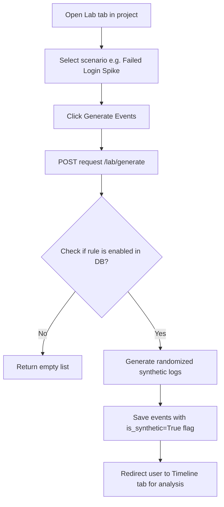

# Feature: Synthetic Security Lab

## 1. Feature Overview
Synthetic Security Lab adalah modul simulasi defensif yang memungkinkan pengguna (khususnya mahasiswa IT dan security apprentice) belajar menganalisis insiden keamanan dengan memproduksi log anomali buatan (*synthetic events*). Dengan menghasilkan data log tiruan untuk skenario anomali tertentu, pengguna dapat mempelajari bentuk pola indikator serangan tanpa mengeksekusi serangan nyata pada target.
- **Pengguna**: Seluruh pengguna terdaftar (Regular & Admin).
- **Pentingnya Fitur**: Menyediakan data latihan investigasi yang kaya secara aman tanpa melanggar kebijakan penggunaan alat ofensif.
- **Scope**: Project-scoped (log tersimpan dan terisolasi di dalam lingkup project).
- **Akses**: Semua user (regular dan admin).

## 2. User Flow
1. User masuk ke project workspace dan memilih tab **Lab** (`/projects/[id]/lab`).
2. User dihadapkan pada menu pilihan beberapa skenario anomali deteksi:
   - Failed Login Spike (Spike kegagalan login)
   - Impossible Travel (Perpindahan lokasi IP yang mustahil)
   - New Device Admin Action (Akses admin dari perangkat baru)
   - Token Reuse (Penggunaan kembali token sesi)
   - Suspicious Data Export (Ekspor data mencurigakan)
3. User mengeklik tombol **Generate Events** pada salah satu skenario.
4. Frontend mengirimkan request POST ke backend `/lab/generate`.
5. Sistem mengecek status aturan deteksi terkait skenario tersebut di DB.
6. Jika aturan aktif, backend memproduksi deretan kejadian tiruan lengkap dengan detail IP, negara asal, endpoint, perangkat penyerang, dan severity score.
7. Kejadian-kejadian tersebut disimpan ke tabel database SQLite `events` dengan flag `is_synthetic = True`.
8. User diarahkan ke tab **Timeline** untuk menganalisis rekonstruksi log kejadian tersebut secara kronologis.



## 3. Route and Page Structure
| Route | File Path | Purpose | Auth Required | Role |
| :--- | :--- | :--- | :--- | :--- |
| `/projects/[id]/lab` | `apps/web/app/projects/[id]/lab/page.tsx` | Halaman simulator pengisian log keamanan | Yes | All |

## 4. Backend API Endpoints
| Method | Endpoint | Router File | Purpose | Auth Required | Role |
| :--- | :--- | :--- | :--- | :--- | :--- |
| `POST` | `/api/v1/projects/{project_id}/lab/generate` | `apps/api/app/routers/lab.py` | Generate log event buatan berdasarkan skenario | Yes | User/Admin |
| `GET` | `/api/v1/projects/{project_id}/events` | `apps/api/app/routers/lab.py` | Mengambil seluruh log kejadian di project | Yes | User/Admin |

## 5. Main Functions and Responsibilities

### 5.1 Frontend Functions
- **`generateSyntheticEvents(projectId, scenarioId)`**
  - **File**: `apps/web/lib/api.ts`
  - **Purpose**: Mengirim parameter skenario untuk digenerate oleh backend.
  - **Input**: `projectId: string`, `scenarioId: string`
  - **Output**: `Event[]` (Koleksi kejadian sintetik yang terbuat)
  - **Called by**: `apps/web/app/projects/[id]/lab/page.tsx`
  - **Calls**: `POST /api/v1/projects/{project_id}/lab/generate`
- **`getProjectEvents(projectId)`**
  - **File**: `apps/web/lib/api.ts`
  - **Purpose**: Mengambil log peristiwa project untuk dirender di UI Lab.
  - **Called by**: `apps/web/app/projects/[id]/lab/page.tsx`

### 5.2 Backend Router Functions
- **`generate_lab_data(project_id, req, db, current_user)`**
  - **File**: `apps/api/app/routers/lab.py`
  - **Purpose**: Menerima request skenario, memicu builder events, dan menyimpannya di DB SQLite.
- **`get_events(project_id, db, current_user)`**
  - **File**: `apps/api/app/routers/lab.py`
  - **Purpose**: Membaca seluruh kejadian (baik sintetik maupun non-sintetik jika ada) yang berasosiasi dengan project.

### 5.3 Backend Service Functions
- **`SyntheticLab.generate_events(db, project_id, scenario_id)`**
  - **File**: `apps/api/app/services/synthetic_lab.py`
  - **Purpose**: Pembangkit data. Memverifikasi apakah aturan deteksi bersangkutan aktif (`DetectionRule.enabled == True`). Jika ya, memproduksi array log buatan dengan parameter acak (User, IP, Device, Country, Severity, dan Risk Score).

### 5.4 Model and Schema Classes
- **`Event`**
  - **File**: `apps/api/app/models/event.py`
  - **Type**: SQLAlchemy Model
  - **Field penting**: `id`, `project_id`, `event_type` (Nama Skenario), `user_label`, `ip_address`, `country`, `device`, `endpoint`, `severity`, `risk_score`, `is_synthetic` (Boolean).

## 6. Function Connection Map
```
apps/web/app/projects/[id]/lab/page.tsx
→ generateSyntheticEvents(projectId, scenarioId) in frontend
  → POST /api/v1/projects/{project_id}/lab/generate
    → generate_lab_data() in backend router
      → SyntheticLab.generate_events() in services
        → Save Event records in DB
        → Returns event payload to frontend UI
```

## 7. Tech Stack Used in This Feature
| Tech | Used In | Purpose | Related Code |
| :--- | :--- | :--- | :--- |
| Random Utility (`random.choice`) | Backend Service | Mensimulasikan data IP dan asal negara acak | `apps/api/app/services/synthetic_lab.py` |
| SQLite Database | DB Storage | Menyimpan instansi logs tiruan | `apps/api/app/routers/lab.py` |

## 8. Code Reference
Code: **Verification of detection rule status**
File: `apps/api/app/services/synthetic_lab.py`
```python
        from app.models.detection_rule import DetectionRule
        rule = db.query(DetectionRule).filter(DetectionRule.key == scenario_id).first()
        if not rule or not rule.enabled:
            # Only generate events if the corresponding rule is enabled
            return []
```
Snippet ini memperlihatkan mekanisme keamanan di mana pembuatan log kejadian tiruan hanya diizinkan apabila aturan pendeteksian terkait dalam keadaan aktif di sistem, menghubungkan pengaturan administrasi dengan behavior simulator.

## 9. Security and Safety Notes
- Fitur ini murni melakukan penulisan record log pasif ke database local SQLite. Tidak ada perintah eksekusi kode eksternal, pengiriman exploit, atau pemindaian jaringan aktif yang dilakukan.
- Flag `is_synthetic` secara konseptual membedakan log buatan dengan log audit nyata apabila ThreatLens nantinya dihubungkan dengan server log produksi.

## 10. Error Handling and Empty State
- Apabila skenario ID tidak dikenal, service mengembalikan array kosong `[]` secara aman tanpa melempar crash.
- Jika pengguna belum men-generate skenario apa pun, halaman lab di sisi frontend menampilkan daftar riwayat kosong untuk log.

## 11. Current Limitations
- **Rules Dependency**: Bila admin mematikan aturan deteksi tertentu di Settings, upaya generate skenario bersangkutan di Lab akan menghasilkan respons kosong tanpa notifikasi error yang jelas kepada regular user di UI.
- **SQLite Concurrency**: Generate log dalam jumlah besar secara berturut-turut pada SQLite lokal dapat memicu kendala penguncian file database (*database is locked*) di lingkungan produksi sesungguhnya.

## 12. Future Improvements
- Tambahkan petunjuk visual di halaman Lab jika suatu skenario tidak dapat di-generate karena aturannya dimatikan oleh admin.
- Implemetasikan ekspor log tiruan dalam format standar Syslog atau JSON agar dapat diunduh untuk latihan di luar dashboard.

## 13. Related Files
- **Frontend**:
  - `apps/web/app/projects/[id]/lab/page.tsx`
- **Backend**:
  - `apps/api/app/routers/lab.py`
  - `apps/api/app/services/synthetic_lab.py`
  - `apps/api/app/models/event.py`
