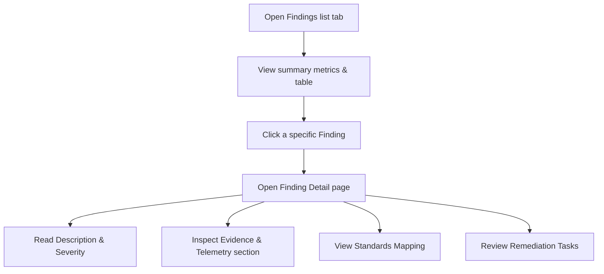

# Feature: Findings & Evidence Management

## 1. Feature Overview
Findings & Evidence Management adalah modul utama untuk menampilkan dan menganalisis celah keamanan atau anomali yang ditemukan selama pemindaian pasif (*passive scan*). Setiap Temuan (*Finding*) dinilai menggunakan tiga metrik utama: **Severity** (Tingkat Keparahan), **Confidence** (Tingkat Keyakinan Deteksi), dan **Blast Radius** (Dampak Penyebaran). Untuk mendukung keabsahan temuan, setiap finding wajib menyertakan **Evidence & Telemetry** (Bukti Mentah) berupa log/header respon HTTP dari mesin pemindaian untuk dianalisis oleh developer.
- **Pengguna**: Seluruh pengguna terdaftar (Regular & Admin).
- **Pentingnya Fitur**: Menyajikan detail kerentanan secara informatif dan transparan berbasis bukti nyata, sehingga pengembang tahu persis mengapa suatu celah terdeteksi.
- **Scope**: Project-scoped (Kerentanan diisolasi di dalam lingkup project).
- **Akses**: Semua user (regular dan admin).

## 2. User Flow
1. User masuk ke project workspace dan memilih tab **Findings** (`/projects/[id]/findings`).
2. User melihat ringkasan kuantitatif temuan (jumlah total Open, High, Medium, Low).
3. User disajikan tabel daftar temuan lengkap dengan status, tingkat keparahan, aset terdampak, dan waktu penemuan.
4. User mengklik salah satu baris temuan untuk masuk ke halaman detail (`/projects/[id]/findings/[findingId]`).
5. Di halaman detail, user membaca:
   - Deskripsi kerentanan.
   - Metrik (Confidence Score, Blast Radius, Detection Context/Rule ID).
   - Standard Mapping (Korelasi dengan framework seperti OWASP).
   - **Evidence & Telemetry** (Menampilkan cuplikan log mentah/response header mentah terkait pemicu celah).
   - Remediation Checklist (Tugas perbaikan).



## 3. Route and Page Structure
| Route | File Path | Purpose | Auth Required | Role |
| :--- | :--- | :--- | :--- | :--- |
| `/projects/[id]/findings` | `apps/web/app/projects/[id]/findings/page.tsx` | Tabel ikhtisar temuan project | Yes | All |
| `/projects/[id]/findings/[findingId]` | `apps/web/app/projects/[id]/findings/[findingId]/page.tsx` | Analisis mendalam celah dan bukti mentah | Yes | All |

## 4. Backend API Endpoints
| Method | Endpoint | Router File | Purpose | Auth Required | Role |
| :--- | :--- | :--- | :--- | :--- | :--- |
| `GET` | `/api/v1/projects/{project_id}/findings` | `apps/api/app/routers/findings.py` | Ambil semua temuan di project | Yes | User/Admin |
| `GET` | `/api/v1/projects/{project_id}/findings/{finding_id}` | `apps/api/app/routers/findings.py` | Ambil detail finding, mappings, dan evidence | Yes | User/Admin |

## 5. Main Functions and Responsibilities

### 5.1 Frontend Functions
- **`getProjectFindings(projectId)`**
  - **File**: `apps/web/lib/api.ts`
  - **Purpose**: Membaca seluruh temuan keamanan di dalam project.
  - **Called by**: `apps/web/app/projects/[id]/findings/page.tsx`
- **`getFindingDetail(projectId, findingId)`**
  - **File**: `apps/web/lib/api.ts`
  - **Purpose**: Membaca data lengkap detail temuan keamanan beserta relasi data standards dan evidence.
  - **Called by**: `apps/web/app/projects/[id]/findings/[findingId]/page.tsx`

### 5.2 Backend Router Functions (`apps/api/app/routers/findings.py`)
- **`get_findings(project_id, db, current_user)`**
  - **Purpose**: Mengembalikan list model `Finding` yang terikat ke `project_id`.
- **`get_finding(project_id, finding_id, db, current_user)`**
  - **Purpose**: Mengonversi record finding ke dictionary, lalu mengeksekusi sub-query untuk menempelkan array data `standards` (dari tabel standard mappings) dan array data `evidence` (dari tabel evidences).

### 5.3 Backend Service Functions
*Status: Not found in current codebase.* Seluruh penyusunan data dilakukan secara dinamis pada level router API.

### 5.4 Model and Schema Classes
- **`Finding`**
  - **File**: `apps/api/app/models/finding.py`
  - **Type**: SQLAlchemy Model
  - **Field penting**: `id`, `project_id`, `asset_id`, `scan_id`, `title`, `category`, `severity` (Critical, High, Medium, Low), `confidence` (High, Medium, Low), `blast_radius`, `description`, `status` (Open, Resolved), `rule_id`, `rule_key`.
- **`Evidence`**
  - **File**: `apps/api/app/models/evidence.py`
  - **Type**: SQLAlchemy Model
  - **Field penting**: `id`, `finding_id`, `source` (asal detektor, misal: "Passive Scan"), `detail` (Log mentah/JSON terenkode), `timestamp`.

## 6. Function Connection Map
```
apps/web/app/projects/[id]/findings/[findingId]/page.tsx
→ getFindingDetail(projectId, findingId) in API client
  → GET /api/v1/projects/{project_id}/findings/{finding_id}
    → get_finding() in apps/api/app/routers/findings.py
      → Query database models: Finding, StandardMapping, Evidence
      → Returns combined dictionary payload
        → Frontend JS maps snake_case to camelCase
        → Render Evidence & Telemetry code block UI
```

## 7. Tech Stack Used in This Feature
| Tech | Used In | Purpose | Related Code |
| :--- | :--- | :--- | :--- |
| JSON Stringifying/Parsing | Frontend UI | Memformat raw JSON evidence agar rapi di layar | `apps/web/app/projects/[id]/findings/[findingId]/page.tsx` |
| SQLAlchemy Join | Backend API | Menggabungkan model Finding dengan StandardMapping | `apps/api/app/routers/projects.py` |

## 8. Code Reference
Code: **Evidence parsing and pretty print**
File: `apps/web/app/projects/[id]/findings/[findingId]/page.tsx`
```tsx
                    <code>
                      {(() => {
                        const content = ev.detail !== undefined ? ev.detail : (ev.data !== undefined ? ev.data : ev);
                        if (typeof content === 'string') {
                          try {
                            return JSON.stringify(JSON.parse(content), null, 2);
                          } catch {
                            return content;
                          }
                        }
                        return JSON.stringify(content, null, 2);
                      })()}
                    </code>
```
Snippet di atas bertugas memparsing string JSON mentah dari DB (seperti log respon HTTP) dan mencetaknya dalam bentuk objek berindentasi rapi agar mudah dipelajari oleh pengguna.

## 9. Security and Safety Notes
- Logika otentikasi `get_owned_finding_or_404` memastikan pengguna tidak dapat menebak finding ID milik project atau pengguna lain.
- **Defensive Boundary**: Bukti mentah (*evidence*) hanya memuat metadata pasif atau log sintetik. Sistem dilarang keras menyimpan kredensial mentah (seperti password) atau token sesi sensitif di dalam database secara terbuka demi melindungi privasi.

## 10. Error Handling and Empty State
- Halaman detail finding menampilkan tulisan "No evidence recorded." apabila data di tabel `evidences` berstatus kosong.
- Halaman tabel findings menggunakan indikator status visual (warna merah untuk High/Critical, kuning untuk Medium, biru untuk Low/Info) agar mudah diprioritaskan.

## 11. Current Limitations
- **Remediation Tasks**: Saat ini array `remediation_tasks` di endpoint router findings dikembalikan sebagai array kosong statis `[]` karena tidak terintegrasi langsung ke tabel database `remediation_tasks` saat pembacaan detail finding individual.

## 12. Future Improvements
- Implemetasikan query database riil untuk menarik data perbaikan (`remediation_tasks`) yang berasosiasi dengan ID temuan keamanan pada router detail.
- Tambahkan kemampuan mengunduh bukti telemetry mentah ke file teks `.log`.

## 13. Related Files
- **Frontend**:
  - `apps/web/app/projects/[id]/findings/page.tsx`
  - `apps/web/app/projects/[id]/findings/[findingId]/page.tsx`
- **Backend**:
  - `apps/api/app/routers/findings.py`
  - `apps/api/app/models/finding.py`
  - `apps/api/app/models/evidence.py`
  - `apps/api/app/schemas/finding.py`
