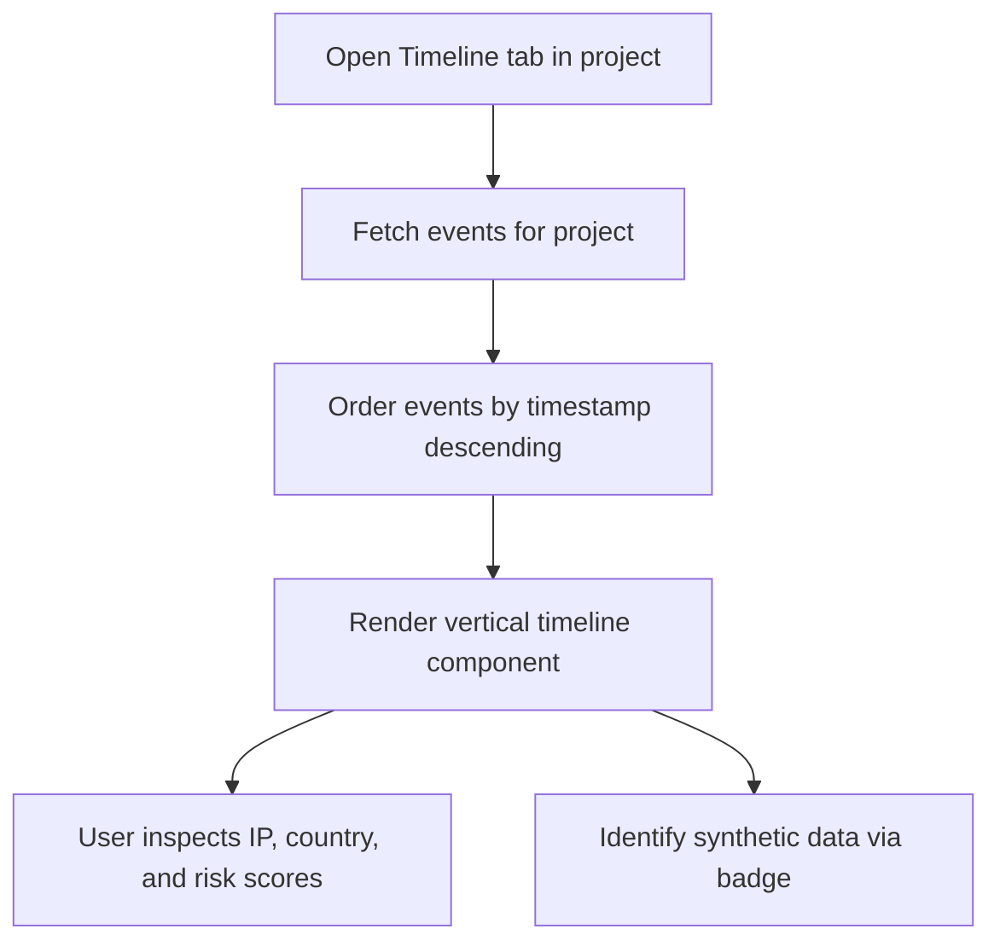

# Feature: Scoped Incident Timeline

## 1. Feature Overview
Incident Timeline adalah fitur untuk merekonstruksi dan memvisualisasikan seluruh kejadian keamanan (*security events*) yang terjadi di dalam project workspace secara kronologis. Kejadian yang tercatat mencakup log anomali otentikasi, akses mencurigakan, ekspor data, hingga aktivitas mencurigakan lainnya yang dihasilkan melalui generator Synthetic Lab.
- **Pengguna**: Seluruh pengguna terdaftar (Regular & Admin).
- **Pentingnya Fitur**: Membantu pengembang dan praktisi keamanan melacak urutan kejadian (*kill chain* atau *incident trail*) untuk memahami kronologi sebelum dan sesudah terjadinya anomali keamanan.
- **Scope**: Project-scoped (Log kejadian dibatasi secara ketat per project workspace).
- **Akses**: Semua user (regular dan admin).

## 2. User Flow
1. User masuk ke project workspace dan memilih tab **Timeline** (`/projects/[id]/timeline`).
2. Frontend mengirim request GET ke backend `/timeline`.
3. Sistem mengambil data log `Event` yang terkait dengan `project_id` pengguna.
4. Sistem mengurutkan log kejadian berdasarkan waktu (*timestamp*) terbaru secara kronologis terbalik.
5. User melihat daftar kejadian berbentuk diagram alur vertikal (timeline) yang mencantumkan:
   - Nama Peristiwa (misal: "Failed Login Spike").
   - Waktu Deteksi (*timestamp*).
   - Pengguna terkait (*User label*).
   - IP Address dan Negara asal.
   - Endpoint target.
   - Perangkat yang digunakan.
   - Indikator badge apakah kejadian tersebut berstatus **Synthetic** (buatan).
   - Tingkat risiko (*risk score*).



## 3. Route and Page Structure
| Route | File Path | Purpose | Auth Required | Role |
| :--- | :--- | :--- | :--- | :--- |
| `/projects/[id]/timeline` | `apps/web/app/projects/[id]/timeline/page.tsx` | Alur kronologi log kejadian keamanan | Yes | All |

## 4. Backend API Endpoints
| Method | Endpoint | Router File | Purpose | Auth Required | Role |
| :--- | :--- | :--- | :--- | :--- | :--- |
| `GET` | `/api/v1/projects/{project_id}/timeline` | `apps/api/app/routers/timeline.py` | Ambil semua log peristiwa di project | Yes | User/Admin |

## 5. Main Functions and Responsibilities

### 5.1 Frontend Functions
- **`getProjectTimeline(projectId)`**
  - **File**: `apps/web/lib/api.ts`
  - **Purpose**: Membaca log kejadian keamanan di project tertentu.
  - **Input**: `projectId: string`
  - **Output**: `Event[]`
  - **Called by**: `apps/web/app/projects/[id]/timeline/page.tsx`
  - **Calls**: `GET /api/v1/projects/{project_id}/timeline`

### 5.2 Backend Router Functions (`apps/api/app/routers/timeline.py`)
- **`get_timeline(project_id, db, current_user)`**
  - **Purpose**: Mengembalikan baris-baris data dari tabel `events` yang memiliki `project_id == project_id`.
  - **Database models used**: `Event` model.

### 5.3 Backend Service Functions
*Status: Not found in current codebase.* Pengurutan dan formatting data dilakukan di tingkat frontend atau query SQL dasar.

### 5.4 Model and Schema Classes
- **`Event`**
  - **File**: `apps/api/app/models/event.py`
  - **Type**: SQLAlchemy Model
  - **Field penting**: `id`, `project_id`, `event_type`, `timestamp`, `user_label`, `ip_address`, `country`, `device`, `endpoint`, `severity`, `risk_score`, `is_synthetic`.

## 6. Function Connection Map
```
apps/web/app/projects/[id]/timeline/page.tsx
→ getProjectTimeline(projectId) in API client
  → GET /api/v1/projects/{project_id}/timeline
    → get_timeline() in apps/api/app/routers/timeline.py
      → Query database Event table
      → Returns events collection
        → Render vertical timeline UI card list
```

## 7. Tech Stack Used in This Feature
| Tech | Used In | Purpose | Related Code |
| :--- | :--- | :--- | :--- |
| Next.js Server Components | Frontend Rendering | Pengambilan data langsung dari sisi server | `apps/web/app/projects/[id]/timeline/page.tsx` |
| SQLite Database | DB Storage | Menyimpan log kronologis | `apps/api/app/models/event.py` |

## 8. Code Reference
Code: **get_timeline endpoint**
File: `apps/api/app/routers/timeline.py`
```python
@router.get("/projects/{project_id}/timeline")
def get_timeline(project_id: str, db: Session = Depends(get_db), current_user: User = Depends(get_current_user)):
    get_owned_project_or_404(db, project_id, current_user)
    return db.query(Event).filter(Event.project_id == project_id).all()
```
Snippet di atas menyaring data log `Event` berdasarkan `project_id` yang terotorisasi untuk user bersangkutan sebelum dikirimkan ke frontend.

## 9. Security and Safety Notes
- Log peristiwa tidak dapat diakses lintas project. Fungsi otentikasi kepemilikan (`get_owned_project_or_404`) menjaga data terisolasi.
- **Defensive Boundary**: Log peristiwa yang ditampilkan adalah log pasif/sintetik untuk tujuan edukasi dan pemantauan kepatuhan defensif.

## 10. Error Handling and Empty State
- Jika data log kosong, frontend merender teks: "No events recorded in the timeline yet. Use the Synthetic Lab to generate test data."
- Error koneksi API ditangani oleh wrapper `ErrorState` di tingkat Shell.

## 11. Current Limitations
- **No Pagination**: Endpoint router belum mendukung pemotongan halaman (pagination). Jika jumlah peristiwa mencapai ribuan, pengambilan seluruh baris SQL sekaligus dapat memicu kelambatan loading.
- **Static Sorting**: Pengurutan kronologis saat ini sepenuhnya bergantung pada urutan input database (default query), bukan diurutkan secara eksplisit pada query SQL `order_by(Event.timestamp.desc())` di backend.

## 12. Future Improvements
- Tambahkan parameter `limit` dan `offset` pada API endpoint `/timeline` untuk mendukung pagination.
- Tambahkan filter berdasarkan `event_type` (Authentication, Data Activity, dsb.) dan `severity` pada UI frontend.

## 13. Related Files
- **Frontend**:
  - `apps/web/app/projects/[id]/timeline/page.tsx`
- **Backend**:
  - `apps/api/app/routers/timeline.py`
  - `apps/api/app/models/event.py`
  - `apps/api/app/schemas/event.py`
