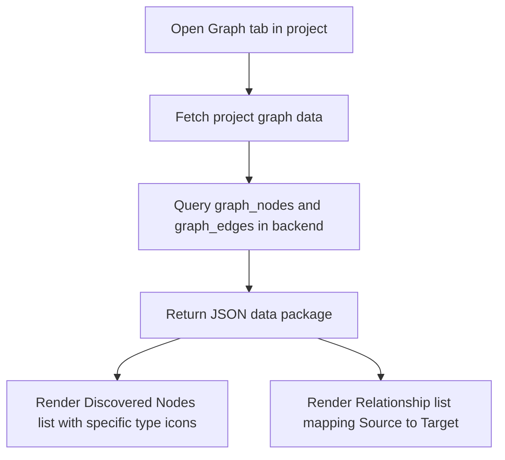

# Feature: Attack Graph Visualization

## 1. Feature Overview
Attack Graph Visualization adalah fitur visual untuk merepresentasikan relasi struktural antar entitas dalam workspace keamanan (seperti hubungan antara Asset, Event, dan Finding). Fitur ini membantu analis keamanan memahami topologi risiko, jalur pergerakan lateral (*lateral movement paths*), dan batas identitas (*identity boundaries*) dalam satu graf node-edge sederhana.
- **Pengguna**: Seluruh pengguna terdaftar (Regular & Admin).
- **Pentingnya Fitur**: Menyajikan pemahaman spasial-struktural kerentanan secara holistik daripada sekadar daftar baris database biasa.
- **Scope**: Project-scoped (graf dibangun khusus per project).
- **Akses**: Semua user (regular dan admin).

## 2. User Flow
1. User masuk ke project workspace dan memilih tab **Graph** (`/projects/[id]/graph`).
2. Frontend memuat data project dan memanggil API graf `/graph`.
3. Backend membaca semua entitas node (`graph_nodes`) dan hubungan edge (`graph_edges`) yang bertaut ke `project_id`.
4. User disajikan dua panel informasi:
   - Panel kiri: Daftar Node Terdeteksi (*Discovered Nodes*) lengkap dengan ikon tipe entitas (👤 User, 🌐 IP Address, 🔑 Session, 🖥️ Asset, ⚡ Event, ⚠️ Finding).
   - Panel kanan: Daftar Hubungan Relasi (*Relationships*) yang memvisualisasikan relasi terarah dari Source Node menuju Target Node beserta nama relasinya (seperti "Has Vulnerability").



## 3. Route and Page Structure
| Route | File Path | Purpose | Auth Required | Role |
| :--- | :--- | :--- | :--- | :--- |
| `/projects/[id]/graph` | `apps/web/app/projects/[id]/graph/page.tsx` | Eksplorasi hubungan entitas dan anomali | Yes | All |

## 4. Backend API Endpoints
| Method | Endpoint | Router File | Purpose | Auth Required | Role |
| :--- | :--- | :--- | :--- | :--- | :--- |
| `GET` | `/api/v1/projects/{project_id}/graph` | `apps/api/app/routers/graph.py` | Ambil semua node dan edge untuk visualisasi graf | Yes | User/Admin |

## 5. Main Functions and Responsibilities

### 5.1 Frontend Functions
- **`getProjectGraph(projectId)`**
  - **File**: `apps/web/lib/api.ts`
  - **Purpose**: Membaca data node dan edge graf untuk project.
  - **Input**: `projectId: string`
  - **Output**: `{ nodes: GraphNode[], edges: GraphEdge[] }`
  - **Called by**: `apps/web/app/projects/[id]/graph/page.tsx`
  - **Calls**: `GET /api/v1/projects/{project_id}/graph`

### 5.2 Backend Router Functions (`apps/api/app/routers/graph.py`)
- **`get_graph(project_id, db, current_user)`**
  - **Purpose**: Menarik seluruh instansi `GraphNode` dan `GraphEdge` yang berasosiasi dengan ID project aktif.

### 5.3 Backend Service Functions
- **`graph_builder.py`**
  - **File**: `apps/api/app/services/graph_builder.py`
  - **Status**: **Not found in current codebase (Empty file)**
  - **Notes**: Modul ini direncanakan untuk menangani kalkulasi graf secara dinamis dari database, namun untuk MVP, penarikan data masih dilakukan secara langsung dari tabel DB yang terisi lewat data seed.

### 5.4 Model and Schema Classes
- **`GraphNode`**
  - **File**: `apps/api/app/models/graph.py`
  - **Type**: SQLAlchemy Model
  - **Field penting**: `id`, `project_id`, `label`, `type` (asset, finding, user, dll.), `risk`, `related_finding_id`.
- **`GraphEdge`**
  - **File**: `apps/api/app/models/graph.py`
  - **Type**: SQLAlchemy Model
  - **Field penting**: `id`, `project_id`, `source_node_id`, `target_node_id`, `relation`, `evidence_id`.

## 6. Function Connection Map
```
apps/web/app/projects/[id]/graph/page.tsx
→ getProjectGraph(projectId) in frontend
  → GET /api/v1/projects/{project_id}/graph
    → get_graph() in apps/api/app/routers/graph.py
      → Query database models: GraphNode, GraphEdge
      → Return payload {"nodes": [...], "edges": [...]}
```

## 7. Tech Stack Used in This Feature
| Tech | Used In | Purpose | Related Code |
| :--- | :--- | :--- | :--- |
| Tailwind CSS flex/grid | Frontend UI | Layouting daftar hubungan dan tipe node | `apps/web/app/projects/[id]/graph/page.tsx` |
| SQLite Database | DB Storage | Penyimpanan model nodes dan edges | `apps/api/app/models/graph.py` |

## 8. Code Reference
Code: **Frontend node match and type bug**
File: `apps/web/app/projects/[id]/graph/page.tsx`
```typescript
              {edges.map(edge => {
                const sourceNode = nodes.find(n => n.id === edge.sourceId);
                const targetNode = nodes.find(n => n.id === edge.targetId);
                return (
                  // ...
                           {getEdgeLabel(edge.type)}
                  // ...
```
Snippet di atas memperlihatkan pengambilan label dan node relasi di sisi frontend.

## 9. Security and Safety Notes
- Pengecekan otorisasi `get_owned_project_or_404` disematkan pada router API graf untuk memastikan user tidak dapat memetakan topologi infrastruktur aset milik project pengguna lain.

## 10. Error Handling and Empty State
- Jika data node kosong, halaman merender komponen `EmptyState` dengan pesan: "No entity nodes mapped yet."
- Jika data edge kosong, panel relasi merender: "No relationships mapped yet."

## 11. Current Limitations
- **Frontend Naming Mismatches (Bug Render)**: Terdapat ketidakcocokan nama properti objek antara API hasil pemetaan CamelCase dari backend dengan ekspektasi rendering di file `page.tsx` frontend:
  1. Frontend mencari `edge.sourceId` dan `edge.targetId`, sedangkan data dari API terpetakan menjadi `edge.sourceNodeId` dan `edge.targetNodeId`. Hal ini menyebabkan pencarian node sumber dan target mengembalikan `undefined` sehingga UI menampilkan label kosong.
  2. Frontend mencari `edge.type` untuk menampilkan jenis relasi graf, sedangkan properti backend dikirim sebagai `edge.relation`. Ini menyebabkan fungsi `getEdgeLabel` mengembalikan tulisan `"Unknown"` secara default.
- **Static Graph Builder**: File service `graph_builder.py` masih kosong (0 bytes), sehingga data graf tidak dievaluasi secara dinamis melainkan sepenuhnya statis dari data database yang di-seed.

## 12. Future Improvements
- Perbaiki bug pemetaan nama variabel frontend agar membaca properti `sourceNodeId`, `targetNodeId`, dan `relation` secara tepat.
- Kembangkan service `graph_builder.py` agar secara otomatis membuat relasi node-edge dinamis baru ketika scan berhasil menemukan vulnerability baru atau lab data di-generate.
- Gunakan library visualisasi graf interaktif seperti Vis.js, D3.js, atau React Flow untuk merender visualisasi node-edge interaktif alih-alih daftar teks statis.

## 13. Related Files
- **Frontend**:
  - `apps/web/app/projects/[id]/graph/page.tsx`
- **Backend**:
  - `apps/api/app/routers/graph.py`
  - `apps/api/app/models/graph.py`
  - `apps/api/app/services/graph_builder.py`
