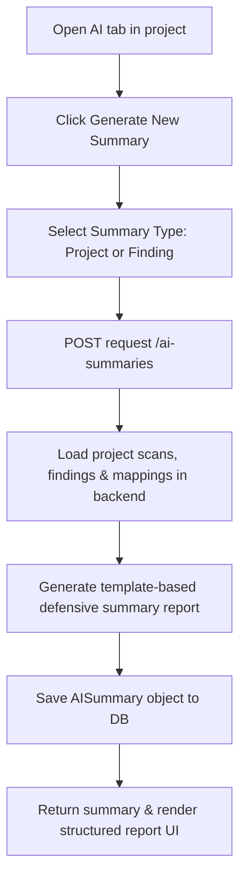

# Feature: AI Investigator (Defensive Summary)

## 1. Feature Overview
AI Investigator adalah fitur analisis bertenaga AI defensif untuk merangkum temuan keamanan (*findings*), menyusun analisis risiko, dan mendeskripsikan dampak teknis dari celah yang terdeteksi tanpa melanggar prinsip kepatuhan etis. Keunikan utama AI Investigator di ThreatLens adalah **sifatnya yang defensif-only**: AI tidak pernah memberikan contoh instruksi eksploitasi aktif, kode penyerangan, atau brute force, melainkan memandu pembenahan secara terstruktur.
- **Pengguna**: Seluruh pengguna terdaftar (Regular & Admin).
- **Pentingnya Fitur**: Menyederhanakan analisis celah keamanan yang rumit menjadi penjelasan bahasa manusia yang terstruktur, lengkap dengan keterbatasan bukti (*unknowns and limitations*).
- **Scope**: Project-scoped (Rangkuman AI dibuat di dalam project terkait).
- **Akses**: Semua user (regular dan admin).

## 2. User Flow
1. User masuk ke project workspace dan memilih tab **AI** (`/projects/[id]/ai`).
2. User melihat daftar ringkasan penyelidikan AI terdahulu yang pernah digenerate.
3. User mengeklik **Generate New Summary**.
4. User memilih jenis rangkuman:
   - **Project Scope Summary**: Merangkum posture keamanan keseluruhan project dan tren dari scan sebelum-sesudah.
   - **Finding Scope Summary**: Fokus pada satu temuan keamanan spesifik (misalnya "Insecure Cookie Flags").
5. User mengeklik **Submit**.
6. Backend memproses data findings, scan history, dan standar pendukung, lalu menyusun laporan investigasi terstruktur.
7. Record baru tersimpan di DB SQLite.
8. User disajikan laporan analisis AI dengan struktur komprehensif:
   - Status Klaim (*claim status*): Suspected / Informational dll.
   - Ringkasan Eksekutif (*executive summary*).
   - Penjelasan Bukti Mentah (*evidence considered*).
   - Penjelasan Tingkat Keyakinan (*confidence explanation*).
   - Estimasi Blast Radius (*impact & blast radius*).
   - Keterbatasan dan Hal yang Belum Diketahui (*unknowns & limitations*).
   - Defensive Safety Boundary (batasan etis).
   - Langkah Remediasi yang Direkomendasikan.



## 3. Route and Page Structure
| Route | File Path | Purpose | Auth Required | Role |
| :--- | :--- | :--- | :--- | :--- |
| `/projects/[id]/ai` | `apps/web/app/projects/[id]/ai/page.tsx` | Panel pembuatan dan pembacaan rangkuman AI | Yes | All |

## 4. Backend API Endpoints
| Method | Endpoint | Router File | Purpose | Auth Required | Role |
| :--- | :--- | :--- | :--- | :--- | :--- |
| `GET` | `/api/v1/{project_id}/ai-summaries` | `apps/api/app/routers/ai_investigation.py` | Ambil semua rangkuman AI milik project | Yes | User/Admin |
| `POST` | `/api/v1/{project_id}/ai-summaries` | `apps/api/app/routers/ai_investigation.py` | Pemicu generate investigasi AI baru | Yes | User/Admin |
| `GET` | `/api/v1/{project_id}/ai-summaries/{summary_id}` | `apps/api/app/routers/ai_investigation.py` | Ambil detail satu rangkuman AI tertentu | Yes | User/Admin |

## 5. Main Functions and Responsibilities

### 5.1 Frontend Functions (di `apps/web/lib/api.ts`)
- **`getProjectAISummaries(projectId)`**
  - **Purpose**: Mengambil histori laporan AI project.
  - **Called by**: `apps/web/app/projects/[id]/ai/page.tsx`
- **`generateProjectAISummary(projectId, payload)`**
  - **Purpose**: Mengirimkan request jenis laporan dan ID finding untuk dirangkum AI.
  - **Called by**: `apps/web/app/projects/[id]/ai/page.tsx`
- **`getProjectAISummary(projectId, summaryId)`**
  - **Purpose**: Membaca detail data laporan AI tertentu untuk ditampilkan.
  - **Called by**: `apps/web/app/projects/[id]/ai/page.tsx`

### 5.2 Backend Router Functions (`apps/api/app/routers/ai_investigation.py`)
- **`list_ai_summaries(project_id, db, current_user)`**
  - **Purpose**: Mengembalikan seluruh record `AISummary` yang bertaut dengan `project_id`.
- **`create_ai_summary(project_id, request, db, current_user)`**
  - **Purpose**: Mengecek keabsahan project dan memicu pemanggilan generator `generate_summary()`.

### 5.3 Backend Service Functions
- **`generate_summary(db, project_id, request)`**
  - **File**: `apps/api/app/services/ai_investigator.py`
  - **Purpose**: Logika perangkum data. Memeriksa scans dan findings aktif, mengevaluasi standar compliance yang cocok, menyusun analisis bukti, menetapkan safety boundary defensive, dan mengembalikan instansi objek `AISummary`.

### 5.4 Model and Schema Classes
- **`AISummary`**
  - **File**: `apps/api/app/models/ai_summary.py`
  - **Type**: SQLAlchemy Model
  - **Field penting**: `id`, `project_id`, `finding_id` (opsional), `title`, `summary_type` ("project" / "finding"), `claim_status`, `executive_summary`, `what_happened`, `evidence_considered_json`, `confidence_explanation`, `impact_blast_radius`, `recommended_remediation_json`, `unknowns_and_limitations`, `safety_boundary`, `created_at`.

## 6. Function Connection Map
```
apps/web/app/projects/[id]/ai/page.tsx
→ generateProjectAISummary(projectId, payload)
  → POST /api/v1/{project_id}/ai-summaries
    → create_ai_summary() in backend router
      → generate_summary() in apps/api/app/services/ai_investigator.py
        → Load database scans/findings/mappings
        → Build defensive summary text templates
        → Save to SQLite & return AISummary
```

## 7. Tech Stack Used in This Feature
| Tech | Used In | Purpose | Related Code |
| :--- | :--- | :--- | :--- |
| JSON Stringifying/Parsing | DB & UI | Menyimpan dan membaca array bukti/remediasi | `apps/api/app/services/ai_investigator.py` |
| SQLite Database | DB Storage | Menyimpan log rangkuman AI | `apps/api/app/models/ai_summary.py` |

## 8. Code Reference
Code: **Defensive Safety Boundary Text**
File: `apps/api/app/services/ai_investigator.py`
```python
    safety_boundary = "This summary is defensive-only. No offensive payloads, credentials, or exploit instructions are generated. Mapping is guidance for remediation, not a formal compliance certification."
```
Pernyataan di atas tertulis di setiap laporan AI untuk menegaskan sifat alat yang defensif dan meniadakan instruksi eksploitasi aktif bagi mahasiswa atau pembaca laporan.

## 9. Security and Safety Notes
- AI Investigator secara ketat mengikuti kebijakan keamanan **Defensive Boundary**:
  - Dilarang memberikan saran perintah penyerangan (seperti sintaks sqlmap atau exploit script).
  - Dilarang membocorkan kredensial.
- Seluruh endpoint dilindungi otorisasi kepemilikan (`get_owned_project_or_404`).

## 10. Error Handling and Empty State
- Jika request pembuatan AI summary gagal karena ID finding tidak valid di project bersangkutan, backend mengembalikan status `400 Bad Request` dengan pesan "Finding not found in this project".
- Jika belum ada laporan penyelidikan AI yang dibuat, halaman frontend merender teks: "No AI investigation summaries generated yet. Click the button above to generate one."

## 11. Current Limitations
- **No External LLM API**: Demi keamanan, kecepatan, dan kendala biaya, versi MVP **belum menggunakan koneksi LLM riil** (seperti Gemini API atau OpenAI). Rangkuman AI dihasilkan lewat **mesin template defensif terprogram (*deterministic template engine*)** pada file `apps/api/app/services/ai_investigator.py`.

## 12. Future Improvements
- Sambungkan modul dengan API Gemini Pro SDK secara aman menggunakan prompt engineering defensif yang melarang penyusunan materi offensif.
- Tambahkan kemampuan untuk menyertakan grafik atau tren visual dalam rangkuman teks.

## 13. Related Files
- **Frontend**:
  - `apps/web/app/projects/[id]/ai/page.tsx`
- **Backend**:
  - `apps/api/app/routers/ai_investigation.py`
  - `apps/api/app/services/ai_investigator.py`
  - `apps/api/app/models/ai_summary.py`
  - `apps/api/app/schemas/ai_summary.py`
