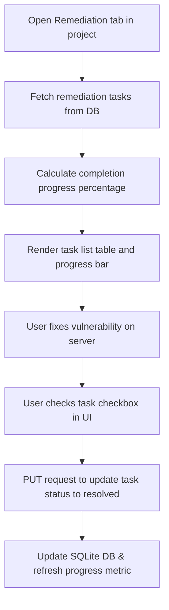

# Feature: Remediation Checklist

## 1. Feature Overview
Remediation Checklist adalah modul pelacakan aksi mitigasi keamanan di tingkat project. Fitur ini membantu pengembang menyusun daftar tindakan perbaikan (*remediation tasks*) yang harus diselesaikan untuk menutup celah keamanan (findings) yang ditemukan. Pengembang dapat memantau prioritas tugas (High, Medium, Low) dan mengubah status perbaikan (misalnya dari "open" menjadi "resolved").
- **Pengguna**: Seluruh pengguna terdaftar (Regular & Admin).
- **Pentingnya Fitur**: Membantu mentransisikan temuan celah keamanan pasif menjadi tindakan aksi pembenahan nyata yang terpantau perkembangannya.
- **Scope**: Project-scoped (Tugas perbaikan terisolasi dalam project workspace).
- **Akses**: Semua user (regular dan admin).

## 2. User Flow
1. User masuk ke project workspace dan memilih tab **Remediation** (`/projects/[id]/remediation`).
2. Sistem memuat seluruh tugas perbaikan yang terikat di dalam project.
3. User melihat ringkasan tugas perbaikan berdasarkan tingkat prioritas (High, Medium, Low) dan persentase progress penyelesaian.
4. User melihat daftar baris tugas perbaikan yang menampilkan judul instruksi perbaikan (misal: "Enable HSTS in Nginx"), prioritas, status ("open" atau "resolved"), dan tanggal pembuatan.
5. User melakukan perbaikan teknis pada infrastrukturnya secara mandiri.
6. User mengeklik checkbox atau tombol status untuk menandai tugas tersebut sebagai **resolved**.
7. Sistem memperbarui status di database SQLite dan memutakhirkan bar kemajuan (*progress bar*) di UI.



## 3. Route and Page Structure
| Route | File Path | Purpose | Auth Required | Role |
| :--- | :--- | :--- | :--- | :--- |
| `/projects/[id]/remediation` | `apps/web/app/projects/[id]/remediation/page.tsx` | Daftar perbaikan kerentanan keamanan | Yes | All |

## 4. Backend API Endpoints
| Method | Endpoint | Router File | Purpose | Auth Required | Role |
| :--- | :--- | :--- | :--- | :--- | :--- |
| `GET` | `/api/v1/projects/{project_id}/remediation` | `apps/api/app/routers/remediation.py` | Ambil semua tugas perbaikan project | Yes | User/Admin |
| `PUT` | `/api/v1/projects/{project_id}/remediation/{task_id}` | `apps/api/app/routers/remediation.py` | Perbarui status tugas perbaikan | Yes | User/Admin |

## 5. Main Functions and Responsibilities

### 5.1 Frontend Functions
- **`getProjectRemediation(projectId)`**
  - **File**: `apps/web/lib/api.ts`
  - **Purpose**: Mengambil tugas perbaikan dalam project workspace.
  - **Called by**: `apps/web/app/projects/[id]/remediation/page.tsx`
- **`updateRemediationTask(projectId, taskId, status)`**
  - **File**: `apps/web/lib/api.ts`
  - **Purpose**: Mengubah status tugas (misal: "open" ke "resolved").
  - **Called by**: `apps/web/app/projects/[id]/remediation/page.tsx`
  - **Calls**: `PUT /api/v1/projects/{project_id}/remediation/{task_id}`

### 5.2 Backend Router Functions (`apps/api/app/routers/remediation.py`)
- **`get_remediation_tasks(project_id, db, current_user)`**
  - **Purpose**: Membaca semua record `RemediationTask` dengan `project_id == project_id`.
- **`update_task_status(project_id, task_id, req, db, current_user)`**
  - **Purpose**: Memvalidasi kepemilikan project, mencari record `task_id`, memperbarui nilainya dengan status baru, mengeksekusi `db.commit()`.

### 5.3 Backend Service Functions
*Status: Not found in current codebase.* Logika dikelola langsung pada fungsi router API.

### 5.4 Model and Schema Classes
- **`RemediationTask`**
  - **File**: `apps/api/app/models/remediation.py`
  - **Type**: SQLAlchemy Model
  - **Field penting**: `id`, `project_id`, `finding_id`, `title`, `status` ("open" / "resolved"), `priority`, `due_date`, `created_at`.
- **`StatusUpdate`**
  - **File**: `apps/api/app/routers/remediation.py`
  - **Type**: Pydantic Schema (didefinisikan inline di router)
  - **Field**: `status: str`.

## 6. Function Connection Map
```
apps/web/app/projects/[id]/remediation/page.tsx
→ updateRemediationTask(projectId, taskId, status) in frontend
  → PUT /api/v1/projects/{project_id}/remediation/{task_id}
    → update_task_status() in apps/api/app/routers/remediation.py
      → Update status field in SQLite DB
      → Return {"msg": "Task updated"}
```

## 7. Tech Stack Used in This Feature
| Tech | Used In | Purpose | Related Code |
| :--- | :--- | :--- | :--- |
| Tailwind Progress Bar | Frontend UI | Visualisasi persentase penyelesaian perbaikan | `apps/web/app/projects/[id]/remediation/page.tsx` |
| SQLAlchemy ORM | DB Update | Modifikasi field status tugas perbaikan | `apps/api/app/routers/remediation.py` |

## 8. Code Reference
Code: **update_task_status endpoint**
File: `apps/api/app/routers/remediation.py`
```python
@router.put("/projects/{project_id}/remediation/{task_id}")
def update_task_status(project_id: str, task_id: str, req: StatusUpdate, db: Session = Depends(get_db), current_user: User = Depends(get_current_user)):
    get_owned_project_or_404(db, project_id, current_user)
    task = db.query(RemediationTask).filter(RemediationTask.id == task_id, RemediationTask.project_id == project_id).first()
    if not task:
        raise HTTPException(status_code=404, detail="Task not found")
    
    task.status = req.status
    db.commit()
    return {"msg": "Task updated"}
```
Kutipan di atas menangani otentikasi kepemilikan project scope dan memodifikasi status dari record perbaikan yang diubah oleh user.

## 9. Security and Safety Notes
- Pengecekan otorisasi `get_owned_project_or_404` mencegah user luar memanipulasi checklist tugas mitigasi keamanan di dalam project.
- **Defensive Boundary**: Sistem hanya bertindak sebagai pencatat progress administratif. Sistem **tidak pernah secara otomatis mengonfigurasi ulang server** pengguna (misalnya mengubah konfigurasi Nginx sesungguhnya), melainkan mendidik pengguna untuk menyetel perbaikan secara mandiri.

## 10. Error Handling and Empty State
- Apabila data checklist kosong, halaman merender: "No remediation tasks defined."
- Jika `task_id` tidak ditemukan saat proses update status, backend melempar exception `404 Not Found`.

## 11. Current Limitations
- **No Automatic Creation**: Mesin scanning pasif (`PassiveChecker`) saat ini belum memproduksi record `RemediationTask` baru secara otomatis ke database SQLite ketika scan baru dijalankan dan menemukan celah. Satu-satunya data yang termuat di dashboard adalah data awal yang didaftarkan secara manual lewat skrip `seed.py`.

## 12. Future Improvements
- Implemetasikan penambahan otomatis record perbaikan (`RemediationTask`) berkorelasi dengan rule temuan baru yang terdeteksi scanner pasif.
- Sediakan panduan mitigasi lengkap dengan potongan konfigurasi (seperti config Nginx untuk HSTS) di dalam card detail tugas remedi.

## 13. Related Files
- **Frontend**:
  - `apps/web/app/projects/[id]/remediation/page.tsx`
- **Backend**:
  - `apps/api/app/routers/remediation.py`
  - `apps/api/app/models/remediation.py`
