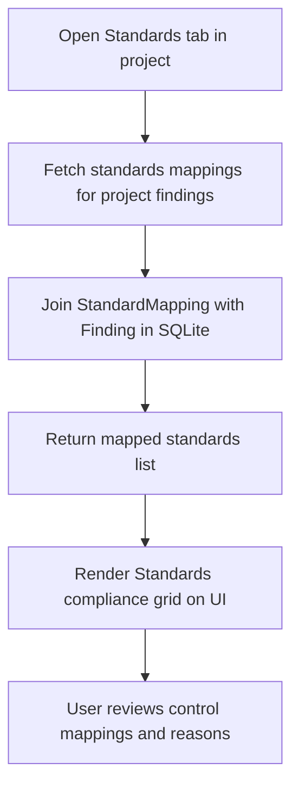

# Feature: Standards & Compliance Mapping

## 1. Feature Overview
Standards & Compliance Mapping adalah fitur yang menghubungkan temuan kerentanan teknis (*findings*) dengan kerangka kerja (framework) standar keamanan eksternal seperti OWASP Top 10 (2021), OWASP ASVS, CWE, MITRE ATT&CK, MITRE D3FEND, dan NIST CSF. Fitur ini membantu pengembang melihat keselarasan kepatuhan (*compliance alignment*) secara defensif dan memahami signifikansi risiko celah teknis di mata regulasi industri.
- **Pengguna**: Seluruh pengguna terdaftar (Regular & Admin).
- **Pentingnya Fitur**: Membantu mentranslasikan temuan celah keamanan teknis menjadi konteks tata kelola kepatuhan standar industri untuk presentasi bagi evaluator, auditor, maupun manajer.
- **Scope**: Project-scoped (Pemetaan disajikan khusus per project workspace).
- **Akses**: Semua user (regular dan admin). Tampilan admin memiliki opsi tambahan untuk mengaktifkan/menonaktifkan standar di Settings.

## 2. User Flow
1. User masuk ke project workspace dan memilih tab **Standards** (`/projects/[id]/standards`).
2. Frontend mengirim request GET ke `/projects/[id]/standards`.
3. Backend membaca data tabel `standard_mappings` yang berelasi dengan temuan di dalam project tersebut.
4. User melihat tabel daftar pemetaan kepatuhan yang mencantumkan:
   - Control ID (misal: "A05:2021", "CWE-1004").
   - Judul Temuan Teknis (*Finding Title*) dan tingkat keparahannya.
   - Framework & Versi Standar (misal: "OWASP Top 10 2021").
   - Deskripsi Kontrol Standar.
   - Alasan Pemetaan (*Mapping Reason*).
5. User juga dapat melihat rincian pemetaan ini langsung saat membuka detail temuan keamanan di tab Findings.



## 3. Route and Page Structure
| Route | File Path | Purpose | Auth Required | Role |
| :--- | :--- | :--- | :--- | :--- |
| `/projects/[id]/standards` | `apps/web/app/projects/[id]/standards/page.tsx` | Dasbor kepatuhan standar keamanan | Yes | All |

## 4. Backend API Endpoints
| Method | Endpoint | Router File | Purpose | Auth Required | Role |
| :--- | :--- | :--- | :--- | :--- | :--- |
| `GET` | `/api/v1/projects/{project_id}/standards` | `apps/api/app/routers/projects.py` | Ambil semua pemetaan standar project | Yes | User/Admin |

## 5. Main Functions and Responsibilities

### 5.1 Frontend Functions
- **`getProjectStandards(projectId)`**
  - **File**: `apps/web/lib/api.ts`
  - **Purpose**: Mengambil daftar pemetaan standar kepatuhan untuk project terpilih.
  - **Input**: `projectId: string`
  - **Output**: `StandardMapping[]`
  - **Called by**: `apps/web/app/projects/[id]/standards/page.tsx`
  - **Calls**: `GET /api/v1/projects/{project_id}/standards`

### 5.2 Backend Router Functions (`apps/api/app/routers/projects.py`)
- **`get_project_standards(project_id, db, current_user)`**
  - **Purpose**: Mengeksekusi query database dengan melakukan `join` antara `StandardMapping` dan `Finding` untuk memfilter pemetaan standar yang hanya dimiliki oleh finding di dalam project bersangkutan (`Finding.project_id == project_id`).

### 5.3 Backend Service Functions
*Status: Not found in current codebase.* Logika join data diselesaikan langsung di tingkat query router API.

### 5.4 Model and Schema Classes
- **`SecurityStandard`**
  - **File**: `apps/api/app/models/standard.py`
  - **Type**: SQLAlchemy Model
  - **Field utama**: `id`, `framework` (OWASP, NIST CSF, dll), `version`, `name`, `is_active` (status aktif standar global).
- **`SecurityControl`**
  - **File**: `apps/api/app/models/standard.py`
  - **Type**: SQLAlchemy Model
  - **Field utama**: `id`, `standard_id`, `control_id` (misal: A05:2021), `title`, `description`, `defensive_guidance`.
- **`StandardMapping`**
  - **File**: `apps/api/app/models/standard.py`
  - **Type**: SQLAlchemy Model
  - **Field utama**: `id`, `finding_id`, `standard_id`, `control_id`, `framework`, `standard_version`, `mapping_reason`, `description`.

## 6. Function Connection Map
```
apps/web/app/projects/[id]/standards/page.tsx
→ getProjectStandards(projectId) in frontend
  → GET /api/v1/projects/{project_id}/standards
    → get_project_standards() in apps/api/app/routers/projects.py
      → JOIN StandardMapping & Finding where Finding.project_id == project_id
      → Return mapped payload
        → Render compliance list on UI grid
```

## 7. Tech Stack Used in This Feature
| Tech | Used In | Purpose | Related Code |
| :--- | :--- | :--- | :--- |
| SQLAlchemy Join Query | Backend API | Menggabungkan model temuan dan pemetaan standar | `apps/api/app/routers/projects.py` |
| Next.js Server Components | Frontend | Pengambilan data langsung dari sisi server | `apps/web/app/projects/[id]/standards/page.tsx` |

## 8. Code Reference
Code: **get_project_standards join query**
File: `apps/api/app/routers/projects.py`
```python
@router.get("/{project_id}/standards")
def get_project_standards(project_id: str, db: Session = Depends(get_db), current_user: User = Depends(get_current_user)):
    project = get_owned_project_or_404(db, project_id, current_user)
    
    # Get all standard mappings for findings in this project
    mappings = db.query(StandardMapping).join(Finding, StandardMapping.finding_id == Finding.id).filter(Finding.project_id == project_id).all()
```
Kutipan di atas mengambil daftar pemetaan standard untuk project tertentu dengan menyaring berdasarkan kepemilikan finding di dalam project.

## 9. Security and Safety Notes
- Pengecekan otorisasi `get_owned_project_or_404` memastikan daftar kepatuhan berproteksi project-scoped dan tidak dapat dibaca oleh pihak luar.
- **Defensive & Safety Disclaimer**: Pemetaan standar ini murni bertujuan sebagai **panduan remediasi internal** untuk membantu memulihkan postur keamanan, dan bukan merupakan sertifikasi formal kepatuhan audit regulasi pihak ketiga yang resmi.

## 10. Error Handling and Empty State
- Jika project belum memiliki temuan yang dipetakan ke standar mana pun, halaman merender: "No standards mappings available. Run passive scans to identify vulnerabilities and link them to compliance frameworks."

## 11. Current Limitations
- **Passive Scanner Mapping Limit**: Mesin scanner pasif (`PassiveChecker.py`) saat ini hanya melakukan pemetaan keras (*hardcoded*) untuk aturan `missing_hsts_header` (ke OWASP `A05:2021`) dan `insecure_cookie_flags` (ke CWE `CWE-1004`). Temuan-temuan lain belum otomatis memicu pemetaan standar dinamis pada level database.

## 12. Future Improvements
- Implemetasikan algoritma pemetaan berbasis aturan yang lebih dinamis untuk mencocokkan setiap temuan baru secara langsung dengan tabel `security_controls` di DB.
- Sediakan fitur pencarian dan penyaringan standar (misalnya menampilkan hanya OWASP Top 10 saja) di UI frontend.

## 13. Related Files
- **Frontend**:
  - `apps/web/app/projects/[id]/standards/page.tsx`
- **Backend**:
  - `apps/api/app/routers/projects.py`
  - `apps/api/app/routers/standards.py`
  - `apps/api/app/models/standard.py`
  - `apps/api/app/schemas/standard.py`
