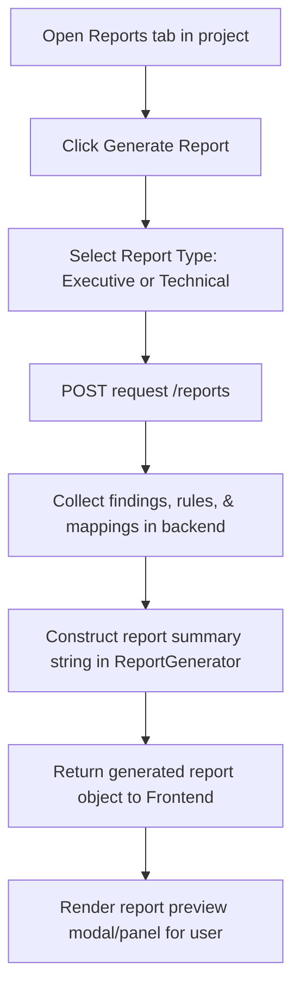

# Feature: Report Generation

## 1. Feature Overview
Report Generation adalah fitur untuk merangkum hasil investigasi keamanan, data temuan kerentanan, data scan, dan pemetaan standar keamanan ke dalam dokumen laporan yang terstruktur. Fitur ini dirancang untuk memfasilitasi kebutuhan pelaporan teknis (*technical report*) maupun ringkasan eksekutif (*executive report*) bagi pengembang atau evaluator.
- **Pengguna**: Seluruh pengguna terdaftar (Regular & Admin).
- **Pentingnya Fitur**: Memudahkan ekstraksi data temuan keamanan ke dalam format laporan siap cetak/baca dengan disclaimer etis penggunaan alat defensif yang jelas.
- **Scope**: Project-scoped (Laporan disaring dan dihasilkan berdasarkan cakupan project).
- **Akses**: Semua user (regular dan admin).

## 2. User Flow
1. User masuk ke project workspace dan memilih tab **Reports** (`/projects/[id]/reports`).
2. User melihat histori laporan yang tersedia di project.
3. User mengeklik **Generate Report**.
4. User memilih jenis laporan:
   - **Executive**: Rangkuman kepatuhan postur keamanan tingkat tinggi untuk manajemen.
   - **Technical**: Detail teknis temuan kerentanan lengkap dengan rule key dan pemicu deteksi untuk tim pengembang.
5. User mengeklik **Submit**.
6. Backend memproses data findings, mendeteksi korelasi rule global dan compliance mapping, lalu memformulasikan teks laporan terstruktur.
7. Laporan ditampilkan langsung di layar sebagai preview yang dapat dicetak (*print preview*).



## 3. Route and Page Structure
| Route | File Path | Purpose | Auth Required | Role |
| :--- | :--- | :--- | :--- | :--- |
| `/projects/[id]/reports` | `apps/web/app/projects/[id]/reports/page.tsx` | Panel histori dan pembuatan laporan PDF/Teks | Yes | All |

## 4. Backend API Endpoints
| Method | Endpoint | Router File | Purpose | Auth Required | Role |
| :--- | :--- | :--- | :--- | :--- | :--- |
| `GET` | `/api/v1/projects/{project_id}/reports` | `apps/api/app/routers/reports.py` | Ambil histori laporan terdaftar di project | Yes | User/Admin |
| `POST` | `/api/v1/projects/{project_id}/reports` | `apps/api/app/routers/reports.py` | Generate instansi laporan baru secara dinamis | Yes | User/Admin |

## 5. Main Functions and Responsibilities

### 5.1 Frontend Functions (di `apps/web/lib/api.ts`)
- **`getProjectReports(projectId)`**
  - **Purpose**: Mengambil histori laporan yang disimpan di project.
  - **Called by**: `apps/web/app/projects/[id]/reports/page.tsx`
- **`generateProjectReport(projectId, type)`**
  - **Purpose**: Mengirim perintah generate laporan dengan parameter `type` ("Executive" atau "Technical").
  - **Called by**: `apps/web/app/projects/[id]/reports/page.tsx`

### 5.2 Backend Router Functions (`apps/api/app/routers/reports.py`)
- **`get_reports(project_id, db, current_user)`**
  - **Purpose**: Membaca histori record model `Report` di DB SQLite.
- **`generate_report(project_id, req, db, current_user)`**
  - **Purpose**: Menerima parameter request tipe laporan, lalu memanggil fungsi service `ReportGenerator.generate()` untuk memproduksi laporan secara dinamis.

### 5.3 Backend Service Functions
- **`ReportGenerator.generate(project_id, type, db)`**
  - **File**: `apps/api/app/services/report_generator.py`
  - **Purpose**: Pembangkit konten laporan. Mengambil findings aktif pada project, mengevaluasi aturan deteksi global yang terpicu, merangkum pemetaan standard compliance, menambahkan disclaimer etis alat defensif, dan mengembalikan objek dictionary laporan baru.

### 5.4 Model and Schema Classes
- **`Report`**
  - **File**: `apps/api/app/models/report.py`
  - **Type**: SQLAlchemy Model
  - **Field penting**: `id`, `project_id`, `title`, `type` ("Executive" / "Technical"), `summary` (Konten Laporan), `created_at`.

## 6. Function Connection Map
```
apps/web/app/projects/[id]/reports/page.tsx
→ generateProjectReport(projectId, type) in frontend
  → POST /api/v1/projects/{project_id}/reports
    → generate_report() in apps/api/app/routers/reports.py
      → ReportGenerator.generate() in services
        → Return dictionary to frontend UI
          → Show report text summary inside preview UI
```

## 7. Tech Stack Used in This Feature
| Tech | Used In | Purpose | Related Code |
| :--- | :--- | :--- | :--- |
| Tailwind CSS print utilities | Frontend UI | Mendukung print-to-PDF via browser | `apps/web/app/projects/[id]/reports/page.tsx` |
| SQLite Database | DB Storage | Menyimpan log laporan statis terdahulu | `apps/api/app/models/report.py` |

## 8. Code Reference
Code: **Report content builder with disclaimer**
File: `apps/api/app/services/report_generator.py`
```python
        summary += "\nNote: All findings are based strictly on active defensive detection rules. "
        summary += "Rules can be managed by Administrators in the Settings console.\n"
        summary += "Disclaimer: This report is not a formal compliance certification. Standards mapping is guidance for remediation and investigation."
```
Snippet di atas menyisipkan catatan penting dan disclaimer ke setiap laporan yang dibuat untuk menegaskan batasan tanggung jawab hukum dan etis alat defensif ThreatLens.

## 9. Security and Safety Notes
- Pengecekan otorisasi `get_owned_project_or_404` disematkan pada setiap endpoint untuk mencegah pengguna lain mengunduh laporan analisis keamanan project.
- **Safety Disclaimer**: Laporan secara ketat memperingatkan bahwa pemetaan standar bukan merupakan formal kepatuhan sertifikasi kepatuhan eksternal.

## 10. Error Handling and Empty State
- Jika project tidak memiliki laporan awal, menu histori reports menampilkan: "No reports generated yet. Click the button above to generate a new report."

## 11. Current Limitations
- **In-Memory Generation (No DB Persist on Generate)**: Endpoint `POST /reports` memicu pembuatan laporan menggunakan `ReportGenerator.generate()`, namun objek laporan yang dihasilkan **tidak disimpan ke database**. Laporan hanya dibuat di memori dan langsung dikembalikan ke frontend. Karenanya, laporan baru tersebut tidak akan muncul di daftar histori laporan saat halaman di-refresh. Histori laporan hanya menampilkan record awal yang terbuat lewat proses `seed.py`.

## 12. Future Improvements
- Modifikasi endpoint `POST /reports` agar menyimpan instansi `Report` yang baru dibuat ke database SQLite agar dapat diakses kembali di histori laporan.
- Tambahkan tombol ekspor laporan langsung ke file dokumen PDF menggunakan library PDF server-side seperti ReportLab atau WeasyPrint.

## 13. Related Files
- **Frontend**:
  - `apps/web/app/projects/[id]/reports/page.tsx`
- **Backend**:
  - `apps/api/app/routers/reports.py`
  - `apps/api/app/services/report_generator.py`
  - `apps/api/app/models/report.py`
