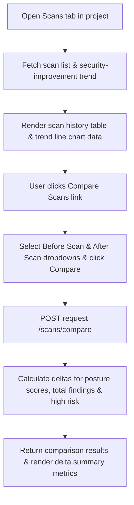

# Feature: Scan History & Compare

## 1. Feature Overview
Scan History & Compare adalah modul untuk mencatat riwayat pemindaian defensif pasif (*passive scan history*) dan membandingkan hasil pemindaian antar waktu. Fitur ini membantu pengembang mendeteksi kemajuan perbaikan keamanan (*security posture improvement*) atau penurunan postur keamanan (*regression*) melalui penghitungan selisih skor (*posture score delta*) dan status temuan.
- **Pengguna**: Seluruh pengguna terdaftar (Regular & Admin).
- **Pentingnya Fitur**: Menyajikan bukti kuantitatif mengenai efektivitas proses remedi dan mempermudah pelacakan kerentanan baru yang muncul.
- **Scope**: Project-scoped (Riwayat scan terisolasi per project workspace).
- **Akses**: Semua user (regular dan admin).

## 2. User Flow
1. User masuk ke project workspace dan memilih tab **Scans** (`/projects/[id]/scans`).
2. Sistem menampilkan bagan tren perbaikan keamanan (*Security Improvement Trend*) jika project memiliki minimal 2 scan.
3. User melihat tabel daftar pemindaian sebelumnya lengkap dengan tanggal scan, tipe scan, status, posture score, total temuan, dan jumlah perbaikan (*fixed findings*).
4. User mengeklik salah satu baris scan untuk membuka detail scan (`/projects/[id]/scans/[scanId]`) guna melihat daftar temuan khusus yang terdeteksi pada scan tersebut.
5. Pada halaman utama Scans, user dapat mengeklik tombol **Compare Scans** (`/projects/[id]/scans/compare`), memilih scan lama sebagai "Before Scan", memilih scan baru sebagai "After Scan", lalu mengeklik **Compare**.
6. Sistem memproses komparasi di backend dan merender ringkasan komparasi:
   - Delta Posture Score (selisih skor).
   - Delta Total Findings (selisih jumlah temuan).
   - Status Ringkasan (Improved, Regression, atau No Significant Change).
   - Jumlah temuan yang berhasil diperbaiki (*fixed findings count*).



## 3. Route and Page Structure
| Route | File Path | Purpose | Auth Required | Role |
| :--- | :--- | :--- | :--- | :--- |
| `/projects/[id]/scans` | `apps/web/app/projects/[id]/scans/page.tsx` | Histori scan dan grafik tren posture score | Yes | All |
| `/projects/[id]/scans/[scanId]` | `apps/web/app/projects/[id]/scans/[scanId]/page.tsx` | Detail temuan spesifik pada satu aktivitas scan | Yes | All |
| `/projects/[id]/scans/compare` | `apps/web/app/projects/[id]/scans/compare/page.tsx` | Komparator "before & after" antar dua scan | Yes | All |

## 4. Backend API Endpoints
| Method | Endpoint | Router File | Purpose | Auth Required | Role |
| :--- | :--- | :--- | :--- | :--- | :--- |
| `GET` | `/api/v1/projects/{project_id}/scans` | `apps/api/app/routers/scans.py` | Ambil histori scan di project | Yes | User/Admin |
| `GET` | `/api/v1/projects/{project_id}/scans/{scan_id}` | `apps/api/app/routers/scans.py` | Ambil detail satu scan dan temuan terkait | Yes | User/Admin |
| `POST` | `/api/v1/projects/{project_id}/scans/compare` | `apps/api/app/routers/scans.py` | Komparasi dua scan (Before & After) | Yes | User/Admin |
| `GET` | `/api/v1/projects/{project_id}/security-improvement` | `apps/api/app/routers/scans.py` | Ambil tren posture score antar scan | Yes | User/Admin |

## 5. Main Functions and Responsibilities

### 5.1 Frontend Functions (di `apps/web/lib/api.ts`)
- **`getProjectScans(projectId)`**
  - **Purpose**: Membaca histori scan.
  - **Called by**: `apps/web/app/projects/[id]/scans/page.tsx`
- **`getProjectScanDetail(projectId, scanId)`**
  - **Purpose**: Membaca satu scan dan temuan terkait.
  - **Called by**: `apps/web/app/projects/[id]/scans/[scanId]/page.tsx`
- **`compareProjectScans(projectId, beforeScanId, afterScanId)`**
  - **Purpose**: Mengirim request perbandingan dua scan.
  - **Called by**: `apps/web/app/projects/[id]/scans/compare/page.tsx`
- **`getProjectSecurityImprovement(projectId)`**
  - **Purpose**: Mengambil data tren kenaikan skor keamanan.
  - **Called by**: `apps/web/app/projects/[id]/scans/page.tsx`

### 5.2 Backend Router Functions (`apps/api/app/routers/scans.py`)
- **`get_project_scans(project_id, db, current_user)`**
  - **Purpose**: Mengambil record scan diurutkan berdasarkan waktu pembuatan terbaru (`Scan.created_at.desc()`).
- **`get_project_scan(project_id, scan_id, db, current_user)`**
  - **Purpose**: Mengambil data `Scan`, `Asset` terkait, dan semua `Finding` yang terbuat pada ID scan tersebut.
- **`compare_scans(project_id, data, db, current_user)`**
  - **Purpose**: Membaca scan Before dan After, membandingkan skor posture, menghitung selisih temuan berisiko tinggi, menetapkan status summary ("Improved", "Regression", "No Significant Change").
- **`get_security_improvement(project_id, db, current_user)`**
  - **Purpose**: Mengambil histori scan berurutan kronologis maju (`Scan.created_at.asc()`), mendeteksi perbaikan antar dua scan terakhir, dan memetakan array tren skor.

### 5.3 Backend Service Functions
*Status: Not found in current codebase.* Logika kalkulasi selisih skor dan status pembandingan dihitung di tingkat fungsi router.

### 5.4 Model and Schema Classes
- **`Scan`**
  - **File**: `apps/api/app/models/scan.py`
  - **Type**: SQLAlchemy Model
  - **Field penting**: `id`, `project_id`, `asset_id`, `scan_type`, `status`, `summary`, `posture_score`, `total_findings`, `high_findings`, `medium_findings`, `low_findings`, `fixed_findings`, `finished_at`.

## 6. Function Connection Map
```
apps/web/app/projects/[id]/scans/compare/page.tsx
→ compareProjectScans(projectId, beforeScanId, afterScanId) in frontend
  → POST /api/v1/projects/{project_id}/scans/compare
    → compare_scans() in apps/api/app/routers/scans.py
      → Fetch Before & After scans from database
      → Calculate posture score & findings delta
      → Return comparison metrics JSON to frontend UI
```

## 7. Tech Stack Used in This Feature
| Tech | Used In | Purpose | Related Code |
| :--- | :--- | :--- | :--- |
| Next.js server/client hooks | Frontend page | Sinkronisasi form pemilihan before-after scan | `apps/web/app/projects/[id]/scans/compare/page.tsx` |
| SQLAlchemy Query Filters | Backend router | Menyaring scan history dan detail finding | `apps/api/app/routers/scans.py` |

## 8. Code Reference
Code: **compare_scans calculation**
File: `apps/api/app/routers/scans.py`
```python
    posture_score_delta = (after_scan.posture_score or 0) - (before_scan.posture_score or 0)
    total_findings_delta = (after_scan.total_findings or 0) - (before_scan.total_findings or 0)
    high_findings_delta = (after_scan.high_findings or 0) - (before_scan.high_findings or 0)
    
    improvement_summary = "No Significant Change"
    if posture_score_delta > 0 or high_findings_delta < 0:
        improvement_summary = "Improved"
    elif posture_score_delta < 0 or high_findings_delta > 0:
        improvement_summary = "Regression"
```
Kutipan di atas memperlihatkan cara sistem memproses kalkulasi selisih tingkat risiko dan skor postur keamanan antar dua scan secara kuantitatif.

## 9. Security and Safety Notes
- Pengecekan otorisasi `get_owned_project_or_404` melindungi seluruh endpoint scan history agar tidak terjadi manipulasi tren riwayat scan project lintas pengguna.
- Pemindaian pasif yang terekam pada riwayat scan tidak mengandung payload ofensif atau brute-force.

## 10. Error Handling and Empty State
- Pengecekan tren `/security-improvement` mengembalikan JSON berstatus `"insufficient_data"` dengan pesan "At least two scans are required to show security improvement." jika project memiliki kurang dari 2 scan. Frontend menangani ini dengan menyembunyikan widget grafik tren secara aman.
- Jika data pembandingan scan tidak ditemukan, API melempar HTTP 404.

## 11. Current Limitations
- **Manual Select Comparison**: Pengguna harus memilih secara manual scan Before dan After untuk dibandingkan. Sistem belum memiliki pemicu otomatis pembandingan scan terjadwal di latar belakang.
- **SQLite Date Diff**: SQLite menyetor waktu sebagai format datetime string, sehingga sorting kronologis maju bergantung penuh pada keakuratan datetime buatan database.

## 12. Future Improvements
- Tambahkan grafik trend line chart dinamis (misalnya menggunakan chart library Chart.js atau Recharts di frontend Next.js) untuk visualisasi tren posture score yang premium.
- Integrasikan perbandingan scan otomatis terhadap baseline scan utama project.

## 13. Related Files
- **Frontend**:
  - `apps/web/app/projects/[id]/scans/page.tsx`
  - `apps/web/app/projects/[id]/scans/[scanId]/page.tsx`
  - `apps/web/app/projects/[id]/scans/compare/page.tsx`
- **Backend**:
  - `apps/api/app/routers/scans.py`
  - `apps/api/app/models/scan.py`
  - `apps/api/app/schemas/scan.py`
