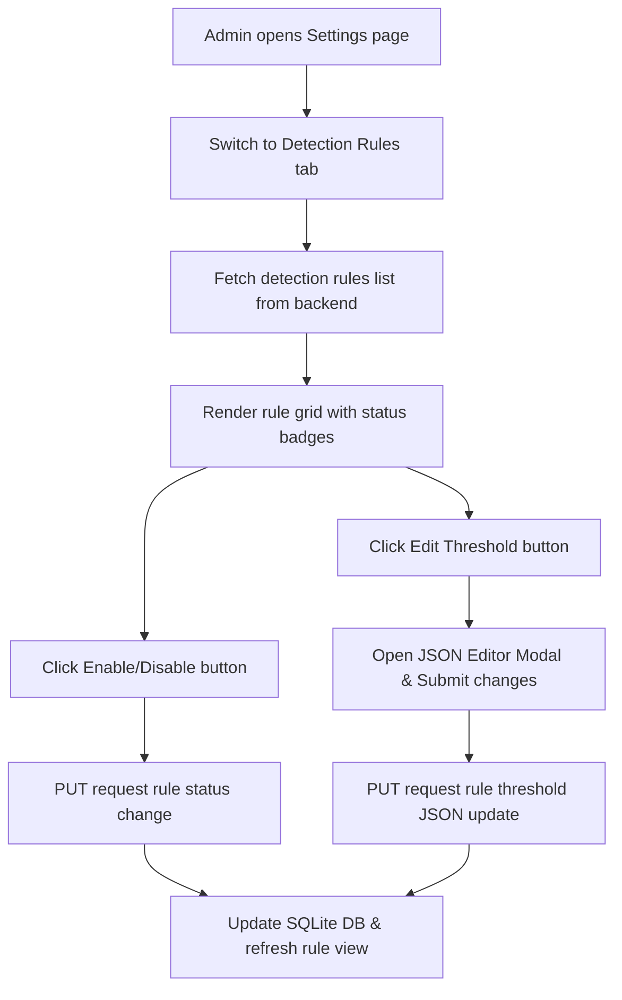

# Feature: Detection Rule Management

## 1. Feature Overview
Detection Rule Management adalah sistem kontrol administratif global yang mengelola seluruh aturan deteksi kerentanan pasif (*passive vulnerability detection rules*) dan aturan pendeteksian anomali lab (*lab anomaly detection rules*). Administrator dapat menyesuaikan sensitivitas scan defensif dengan menyalakan/mematikan aturan individual, mereset aturan ke setelan dasar, atau mengonfigurasi parameter ambang batas (*threshold JSON configuration*).
- **Pengguna**: Administrator Sistem (`admin` & `system_admin`).
- **Pentingnya Fitur**: Memungkinkan penalaan deteksi (*detection tuning*) guna mengurangi temuan palsu (*false positives*) secara global sesuai kebutuhan lingkungan pengembang.
- **Scope**: Global (Aturan berdampak pada seluruh scan di semua project).
- **Akses**: Admin-only (Regular user diblokir total dari pengaksesan dan pengeditan rute/API).

## 2. User Flow
1. Admin login menggunakan kredensial admin (misal: `admin@threatlens.local` / `admin123`).
2. Admin mengklik **Settings** dari navigasi, lalu berpindah ke tab **Detection Rules** (`/settings` tab `detection_rules`).
3. Frontend mengirim request GET ke backend `/settings/detection-rules` untuk memuat semua daftar aturan terdaftar.
4. Admin melihat detail aturan: Nama Rule, Rule Key, Kategori, Tingkat Keparahan (Severity), Tingkat Keyakinan Dasar (Confidence Base), dan status aktif.
5. Admin dapat mengeklik tombol **Disable** atau **Enable** untuk mengubah status keaktifan rule secara instan.
6. Admin dapat mengeklik **Edit Threshold** untuk memunculkan modal editor JSON guna menyunting ambang batas (contoh: menyunting parameter `max_failed_attempts` pada rule `failed_login_spike`).
7. Admin mengklik **Save Configuration** untuk mengirim data JSON baru ke backend.
8. Admin dapat mengeklik **Reset** untuk mengembalikan setelan rule ke status aktif default.



## 3. Route and Page Structure
| Route | File Path | Purpose | Auth Required | Role |
| :--- | :--- | :--- | :--- | :--- |
| `/settings` (Tab: `detection_rules`) | `apps/web/app/settings/page.tsx` | Konsol penyuntingan aturan deteksi global | Yes | Admin Only |

## 4. Backend API Endpoints
| Method | Endpoint | Router File | Purpose | Auth Required | Role |
| :--- | :--- | :--- | :--- | :--- | :--- |
| `GET` | `/api/v1/settings/detection-rules` | `apps/api/app/routers/settings.py` | Ambil semua aturan deteksi global | Yes | Admin Only |
| `GET` | `/api/v1/settings/detection-rules/{rule_id}` | `apps/api/app/routers/settings.py` | Ambil konfigurasi satu aturan | Yes | Admin Only |
| `PUT` | `/api/v1/settings/detection-rules/{rule_id}` | `apps/api/app/routers/settings.py` | Update status/JSON threshold aturan | Yes | Admin Only |
| `POST` | `/api/v1/settings/detection-rules/{rule_id}/reset` | `apps/api/app/routers/settings.py` | Reset rule ke setelan default | Yes | Admin Only |

## 5. Main Functions and Responsibilities

### 5.1 Frontend Functions (di `apps/web/lib/api.ts`)
- **`getDetectionRules()`**
  - **Purpose**: Membaca seluruh konfigurasi aturan deteksi.
  - **Called by**: `apps/web/app/settings/page.tsx`
- **`updateDetectionRule(ruleId, payload)`**
  - **Purpose**: Mengirim modifikasi status `enabled` atau string `thresholdJson` ke database.
  - **Called by**: `apps/web/app/settings/page.tsx`
- **`resetDetectionRule(ruleId)`**
  - **Purpose**: Meminta backend mereset rule terpilih.
  - **Called by**: `apps/web/app/settings/page.tsx`

### 5.2 Backend Router Functions (`apps/api/app/routers/settings.py`)
- **`get_detection_rules(db, current_user)`**
  - **Purpose**: Memeriksa peran admin, mengembalikan daftar `DetectionRule` dari DB.
- **`update_detection_rule(rule_id, update_data, db, current_user)`**
  - **Purpose**: Menerapkan update data parsial (`enabled` atau `threshold_json`) ke record aturan deteksi di DB.
- **`reset_detection_rule(rule_id, db, current_user)`**
  - **Purpose**: Mengatur rule bersangkutan kembali berstatus `enabled=True` dan menyetel severitas ke `"Medium"`.

### 5.3 Backend Service Functions
*Status: Not found in current codebase.* Seluruh pemutakhiran dijalankan langsung melalui router API.

### 5.4 Model and Schema Classes
- **`DetectionRule`**
  - **File**: `apps/api/app/models/detection_rule.py`
  - **Type**: SQLAlchemy Model
  - **Field penting**: `id`, `name`, `key` (misal: "missing_hsts_header"), `category` ("passive_check" / "auth_anomaly"), `enabled` (Boolean), `severity`, `confidence_base`, `threshold_json`, `defensive_only` (Boolean).
- **`DetectionRuleUpdate`**
  - **File**: `apps/api/app/schemas/detection_rule.py`
  - **Type**: Pydantic Schema
  - **Field**: `enabled: Optional[bool]`, `severity: Optional[str]`, `threshold_json: Optional[str]`.

## 6. Function Connection Map
```
apps/web/app/settings/page.tsx
→ updateDetectionRule(ruleId, payload) in frontend
  → PUT /api/v1/settings/detection-rules/{rule_id}
    → update_detection_rule() in apps/api/app/routers/settings.py
      → Apply changes to SQLite DB
      → Return updated DetectionRule response
```

## 7. Tech Stack Used in This Feature
| Tech | Used In | Purpose | Related Code |
| :--- | :--- | :--- | :--- |
| JSON validation | Frontend Modal | Menolak simpan jika input string threshold bukan format JSON valid | `apps/web/app/settings/page.tsx` |
| SQLite Database | DB Storage | Menyimpan status rule global | `apps/api/app/models/detection_rule.py` |

## 8. Code Reference
Code: **Verification of Admin Privilege**
File: `apps/api/app/routers/settings.py`
```python
@router.get("/detection-rules", response_model=List[DetectionRuleResponse])
def get_detection_rules(db: Session = Depends(get_db), current_user: User = Depends(get_current_user)):
    if current_user.role not in ["admin", "system_admin"]:
        raise HTTPException(status_code=403, detail="Only administrators can view detection rules.")
    return db.query(DetectionRule).all()
```
Snippet ini menghentikan secara paksa proses query database jika user yang sedang aktif tidak memiliki peran administratif (`admin` atau `system_admin`), mengamankan integritas engine deteksi.

## 9. Security and Safety Notes
- Pengecekan role admin diterapkan secara konsisten pada backend router API. Upaya bypassing di frontend Next.js akan menghasilkan respons error HTTP 403 Forbidden di backend.
- **Defensive Guardrail**: Seluruh aturan deteksi memiliki flag `defensive_only = True` secara default, membatasi kemampuan sistem agar tidak pernah menjalankan perintah ofensif.

## 10. Error Handling and Empty State
- Jika editor threshold diisi string JSON yang cacat struktur (invalid JSON), web frontend akan melempar peringatan browser pop-up `alert("Invalid JSON or failed to update...")` dan membatalkan proses submit.
- Jika pengguna biasa (non-admin) mencoba membuka tab Detection Rules, web frontend merender block pesan: "Only administrators can manage detection rules."

## 11. Current Limitations
- **No Active Sync**: Ketika admin menonaktifkan aturan deteksi, temuan lama yang sudah dihasilkan oleh aturan tersebut di scan terdahulu tidak akan otomatis terhapus atau berubah status di DB. Aturan baru hanya berdampak pada scanning atau simulasi yang dijalankan setelah perubahan aturan disimpan.

## 12. Future Improvements
- Implemetasikan skema validasi terstruktur untuk threshold JSON di backend menggunakan Pydantic dynamic validation, bukan sekadar validasi string JSON mentah.
- Tambahkan logs riwayat audit (*audit logs*) untuk mencatat waktu dan admin bersangkutan ketika melakukan modifikasi rule global.

## 13. Related Files
- **Frontend**:
  - `apps/web/app/settings/page.tsx`
- **Backend**:
  - `apps/api/app/routers/settings.py`
  - `apps/api/app/models/detection_rule.py`
  - `apps/api/app/schemas/detection_rule.py`
