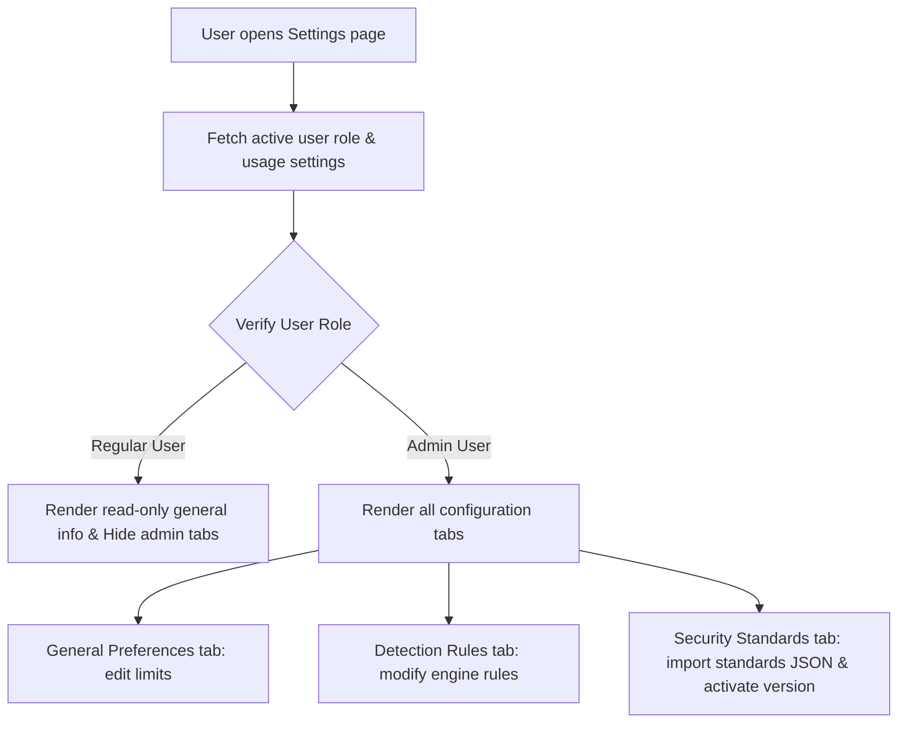

# Feature: Settings & System Administration

## 1. Feature Overview
Settings & System Administration adalah panel kendali pusat untuk memanipulasi preferensi global sistem, kuota batas pemakaian pengguna, serta pustaka standar keamanan. Panel ini membagi otorisasi secara ketat antara regular user dan administrator: regular user hanya dapat melihat informasi kuota umum mereka, sedangkan administrator memiliki hak penuh untuk mengubah parameter mesin deteksi dan mengimpor pustaka standar keamanan baru dalam format JSON.
- **Pengguna**: Seluruh pengguna terdaftar (Regular & Admin).
- **Pentingnya Fitur**: Menyediakan kontrol manajemen atas kuota sumber daya (project dan token AI) serta pemeliharaan standar kepatuhan.
- **Scope**: Global (Mempengaruhi perilaku sistem secara keseluruhan).
- **Akses**: Terbagi:
  - **Regular User**: Read-only kuota umum.
  - **Admin**: Akses tulis ke Detection Rules dan Security Standards.

## 2. User Flow
1. User masuk ke menu **Settings** (`/settings`) pada sidebar navigasi global.
2. Sistem mendeteksi role pengguna aktif:
   - Jika regular user: Hanya tab **General Preferences** yang aktif dengan status read-only (atau mock update), sedangkan tab Detection Rules dan Security Standards memblokir tampilan.
   - Jika admin: Seluruh tab (**General Preferences**, **Detection Rules**, dan **Security Standards**) aktif sepenuhnya.
3. Untuk modifikasi Standar Keamanan (Admin):
   - Admin berpindah ke tab **Security Standards**.
   - Admin melihat pustaka standar aktif (misal: OWASP Top 10, NIST CSF).
   - Admin dapat mengeklik **Activate** untuk menyetel standar default sistem.
   - Admin dapat menempelkan teks format JSON standar baru pada kolom textarea, lalu mengeklik **Import Data** untuk menambah standar baru beserta daftar kontrol di dalamnya.



## 3. Route and Page Structure
| Route | File Path | Purpose | Auth Required | Role |
| :--- | :--- | :--- | :--- | :--- |
| `/settings` | `apps/web/app/settings/page.tsx` | Panel kontrol preferensi dan konfigurasi sistem | Yes | All (Penyaringan fitur dilakukan di dalam file) |

## 4. Backend API Endpoints
| Method | Endpoint | Router File | Purpose | Auth Required | Role |
| :--- | :--- | :--- | :--- | :--- | :--- |
| `GET` | `/api/v1/settings/usage` | `apps/api/app/routers/settings.py` | Ambil limit kuota pengguna aktif | Yes | User/Admin |
| `GET` | `/api/v1/settings/security-standards` | `apps/api/app/routers/settings.py` | Ambil daftar pustaka standar keamanan | Yes | User/Admin (Read-only) |
| `POST` | `/api/v1/settings/security-standards` | `apps/api/app/routers/settings.py` | Buat standar keamanan baru | Yes | Admin Only |
| `POST` | `/api/v1/settings/security-standards/import` | `apps/api/app/routers/settings.py` | Impor standar + kontrol via payload JSON | Yes | Admin Only |
| `POST` | `/api/v1/settings/security-standards/{standard_id}/activate` | `apps/api/app/routers/settings.py` | Aktifkan standar versi tertentu secara global | Yes | Admin Only |

## 5. Main Functions and Responsibilities

### 5.1 Frontend Functions (di `apps/web/lib/api.ts`)
- **`getUsageSettings()`**
  - **Purpose**: Membaca kuota project & token user.
  - **Called by**: `apps/web/app/settings/page.tsx`
- **`updateSettings(data)`**
  - **Status**: **Mock-only**
  - **Purpose**: Fungsi pembungkus frontend untuk mengupdate setting. Karena backend belum mendukung endpoint modifikasi limit usage, fungsi ini hanya mengembalikan `{ msg: "Settings updated" }` statis di frontend.
- **`getSecurityStandards()`**
  - **Purpose**: Membaca standar keamanan aktif.
  - **Called by**: `apps/web/app/settings/page.tsx`
- **`importSecurityStandards(payload)`**
  - **Purpose**: Mengirimkan payload objek standar baru untuk diparsing backend.
  - **Called by**: `apps/web/app/settings/page.tsx`
- **`activateSecurityStandard(standardId)`**
  - **Purpose**: Mengaktifkan standar keamanan tertentu secara global.
  - **Called by**: `apps/web/app/settings/page.tsx`

### 5.2 Backend Router Functions (`apps/api/app/routers/settings.py`)
- **`get_usage(db, current_user)`**
  - **Purpose**: Mengembalikan kuota limit project dan token yang melekat pada model `User` bersangkutan.
- **`import_security_standards(payload, db, current_user)`**
  - **Purpose**: Menerima schema JSON, memecah properti ke model `SecurityStandard` dan instansi `SecurityControl` anak, lalu melakukan commit database.
- **`activate_security_standard(standard_id, db, current_user)`**
  - **Purpose**: Mengubah field `is_active = False` pada standar lain yang memiliki framework sejenis, lalu mengubah `is_active = True` untuk ID terpilih.

### 5.3 Backend Service / Helper Functions
*Status: Not found in current codebase.* Logika diimplementasikan langsung pada query router.

### 5.4 Model and Schema Classes
- **`SecurityStandard` & `SecurityControl`**
  - **File**: `apps/api/app/models/standard.py`
  - **Type**: SQLAlchemy Models (lihat dokumentasi modul Standards Mapping).
- **`SecurityStandardImport`**
  - **File**: `apps/api/app/schemas/standard.py`
  - **Type**: Pydantic Schema
  - **Purpose**: Validasi struktur impor standard JSON. Field penentu: `framework`, `version`, `name`, `controls` (List dari `SecurityControlCreate`).

## 6. Function Connection Map
```
apps/web/app/settings/page.tsx (Tab Standards)
→ importSecurityStandards(parsedJson) in frontend
  → POST /api/v1/settings/security-standards/import
    → import_security_standards() in apps/api/app/routers/settings.py
      → Insert SecurityStandard record
      → Loop inserts SecurityControl records
      → SQLite Transaction Commit & return imported standard structure
```

## 7. Tech Stack Used in This Feature
| Tech | Used In | Purpose | Related Code |
| :--- | :--- | :--- | :--- |
| Tailwind Tab switching | Frontend UI | Navigasi antar opsi preferensi secara responsif | `apps/web/app/settings/page.tsx` |
| SQLite Database | DB Storage | Menyimpan pustaka standar keamanan | `apps/api/app/models/standard.py` |

## 8. Code Reference
Code: **activate_security_standard route**
File: `apps/api/app/routers/settings.py`
```python
@router.post("/security-standards/{standard_id}/activate")
def activate_security_standard(standard_id: str, db: Session = Depends(get_db), current_user: User = Depends(get_current_user)):
    if current_user.role not in ["admin", "system_admin"]:
        raise HTTPException(status_code=403, detail="Only administrators can manage security standards.")
        
    std = db.query(SecurityStandard).filter(SecurityStandard.id == standard_id).first()
    if not std:
        raise HTTPException(status_code=404, detail="Standard not found")
        
    # Deactivate other standards with the same framework
    db.query(SecurityStandard).filter(SecurityStandard.framework == std.framework).update({"is_active": False})
    std.is_active = True
    db.commit()
```
Kutipan di atas memperlihatkan cara sistem mengaktifkan suatu standar keamanan (dan menonaktifkan versi standar sejenis lainnya secara massal di database) dengan membatasi proses hanya bagi pengguna administratif.

## 9. Security and Safety Notes
- Logika keamanan bersandar pada dependensi `get_current_user` dan pemeriksaan `current_user.role` di backend. Setiap endpoint kritis di router `settings.py` menerapkan filter role admin secara ketat.

## 10. Error Handling and Empty State
- Pengecekan parsing JSON pada text area formulir import diproteksi di sisi frontend Next.js menggunakan blok `try-catch` dengan fungsi `JSON.parse()`. Jika string tidak valid, import dibatalkan dan memunculkan peringatan "Import failed...".
- Jika daftar standar keamanan kosong di basis data, tabel merender baris: "No standards found".

## 11. Current Limitations
- **General Preferences Mock Update**: Perubahan pada formulir General Preferences (seperti menyunting projectLimit dan tokenLimit) saat ini **tidak tersimpan ke backend** (Frontend menggunakan fungsi mock `updateSettings` yang tidak memiliki endpoint padanan di router backend).
- **Import JSON Schema Errors**: Bila skema JSON yang diimpor tidak sesuai dengan spesifikasi kolom `SecurityStandardImport` (misalnya salah mengetik properti control), API melempar error status 422 secara raw tanpa parsing error yang ramah pengguna.

## 12. Future Improvements
- Kembangkan API endpoint `PUT /settings/usage` pada backend agar perubahan preferensi limit kuota user benar-benar tersimpan di database.
- Sediakan file template JSON standar keamanan yang dapat diunduh untuk mempermudah admin menyusun skema impor standar baru.

## 13. Related Files
- **Frontend**:
  - `apps/web/app/settings/page.tsx`
- **Backend**:
  - `apps/api/app/routers/settings.py`
  - `apps/api/app/models/standard.py`
  - `apps/api/app/schemas/standard.py`
