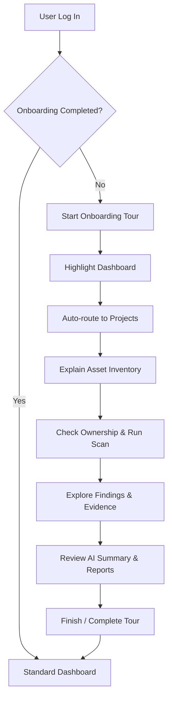

# Guided Onboarding Tour (17-guided-onboarding)

This feature provides an interactive guided onboarding tour to help new users understand the defensive, evidence-based security workflow of ThreatLens.

## Feature Overview

When a user logs in for the first time, ThreatLens displays a guided step-by-step tour highlighting critical UI elements and explaining how they fit into the defensive auditing lifecycle.

The tour highlights exactly what ThreatLens does:
- Grouping audits inside defensive **Projects**.
- Monitoring verified **Assets**.
- Running secure, non-intrusive **Passive Checks**.
- Collecting concrete **Evidence** to prove each vulnerability.
- Utilizing local **AI Investigator** summaries to guide mitigation without violating privacy boundaries.
- Generating comprehensive, evidence-backed security **Reports**.

---

## User Flow

1. **Auto-Start**: The system queries `/api/v1/auth/me` on boot. If `onboardingCompleted` is `false`, the tour starts immediately.
2. **Step Progress**: Clicking **Next** increments the step. If the next step target resides on a different page, the router redirects the user, polls for the target element's presence, and places a spotlight overlay.
3. **Dismissal**: Users can click **Skip** at any point, which signals the backend to mark the tour as complete.
4. **Manual Restart**: Users can click **Restart Guided Tour** in the sidebar profile menu to start the flow again.

---

## Backend Endpoints

All onboarding endpoints require user authentication:

* **`GET /api/v1/auth/me`**
  - Includes user onboarding parameters:
    - `onboarding_completed` (Boolean)
    - `onboarding_completed_at` (DateTime | null)
    - `onboarding_step` (String | null)

* **`PATCH /api/v1/auth/onboarding/progress`**
  - Body: `{"step": "dashboard_welcome"}`
  - Updates the active user step in the database to allow cross-session persistence.

* **`POST /api/v1/auth/onboarding/complete`**
  - Marks onboarding as finished, sets `onboarding_completed = true` and `onboarding_completed_at = now()`.

* **`POST /api/v1/auth/onboarding/reset`**
  - Sets `onboarding_completed = false` and clears progress timestamps and step indices, enabling the user to start again.

---

## Frontend Components

* **`OnboardingProvider.tsx`**
  - React Context coordinator that exposes state (`active`, `currentStepIndex`, `loading`) and sync actions (`restartTour`, `refreshUser`, `setCurrentStepIndex`).
* **`OnboardingTour.tsx`**
  - Displays the spotlight cut-out mask dynamically positioned over the element via coordinates from `getBoundingClientRect()`. Listens to scroll/resize and schedules redirects.
* **`OnboardingTooltip.tsx`**
  - Styled floating window rendering titles, descriptions, safety guardrails, and control buttons (Back, Next, Skip, Finish). If a target element is missing, it automatically falls back to viewport-centered dialog display.
* **`onboarding-steps.ts`**
  - Configuration array detailing metadata (selectors, text, paths, alignments) for each of the 14 onboarding steps.

---

## Onboarding Steps

1. `dashboard_welcome` (Dashboard overview card)
2. `project_menu` (Sidebar "Projects" link)
3. `projects_page` (Projects workspace dashboard)
4. `create_project` ("Create Project" button)
5. `project_overview` (Workspace posture/status overview metrics)
6. `assets_tab` (Asset inventory inventory table)
7. `add_asset` ("Add Asset" button)
8. `ownership_confirmation` (Asset ownership declaration checkbox)
9. `passive_check` ("Run Passive Check" scanner button)
10. `findings` (Vulnerability list dashboard)
11. `evidence` (Finding evidence logs & telemetry)
12. `ai_investigator` (AI summary generator panel)
13. `reports` (Evidence-backed report creator)
14. `finish` (User menu / profile settings reset indicator)

---

## Tech Stack & Styling

- **Backend**: FastAPI, SQLAlchemy, SQLite.
- **Frontend**: Next.js App Router (React 19), TypeScript, Tailwind CSS.
- **Theme**: Dark Slate base (`bg-slate-950/bg-slate-900`) with blue accents (`bg-blue-600/ring-blue-500`).
- **Overlay Mask**: Spotlight spotlight mask achieved dynamically using `ring-[9999px] ring-slate-950/60` and `ring-offset-2 ring-offset-blue-500`.

---

## Security & Safety Boundaries

> [!IMPORTANT]
> **Defensive-Only Boundary**:
> ThreatLens is explicitly a defensive auditing system. The onboarding tour contains clear warnings on steps containing scan interactions (Ownership Confirmation and Passive Check) to reinforce that:
> - ThreatLens only tests assets you own or are authorized to verify.
> - ThreatLens does not perform brute forcing, credential theft, authentication bypass, or execute offensive payloads.

> [!CAUTION]
> **Token Integrity**:
> User onboarding state is stored persistently in the SQLite database and fetched via HttpOnly session cookies. No session tokens are stored in unencrypted browser client variables like LocalStorage or SessionStorage.
